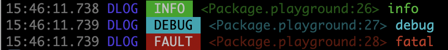

# DLog

[](https://developer.apple.com/swift)

[](https://swift.org/package-manager/)

Flexible and powerful logger for Swift. DLog supports emoji and colored text output, oslog, pipelines, filtering, scopes, intervals and more.

- [Getting started](#getting-started)
- [Log levels](#log-levels)
	- [`trace`](#trace)
	- [`info`](#info)
	- [`debug`](#debug)
	- [`error`](#error)
	- [`assert`](#assert)
	- [`fault`](#fault)
- [Scope](#scope)
- [Interval](#interval)
- [Category](#category)
- [Outputs](#outputs)
	- [Text](#text)
	- [Standard](#standard)
	- [File](#file)
	- [OSLog](#oslog)
	- [Adaptive](#adaptive)
	- [Net](#net)
- [Pipeline](#pipeline)
- [Filter](#filter)
- [`DLog.disabled`](#dlogdisabled)
- [Installation](#installation)
- [License](#license)

## Getting started

By default `DLog` provides basic text console output:

``` swift
// Import the package
import DLog

// Create a logger
let log = DLog()

// Log debug message
log.debug("Hello DLog!")
```

Outputs:

```
21:03:52.276 [DLOG] [DEBUG] <Package.playground:4> Hello DLog!
```
Where:
- `21:03:52.276` - timestamp (HH:mm:ss.SSS)
- `[DLOG]` - category tag ('DLOG' by default)
- `[DEBUG]` - logging type tag
- `<Package.playground:4>` - location (file:line)
- `Hello DLog!` - message

## Log levels

### `trace`

Log the current function name or a message (if it is provided) to help debug problems during the development:

``` swift
let log = DLog()

func startup() {
	log.trace("Start")
	log.trace()
}

startup()
```
Outputs:
```
23:02:52.601 [DLOG] [TRACE] <Package.playground:7> Start
23:02:52.603 [DLOG] [TRACE] <Package.playground:8> startup()
```

### `info`

Log an information message and helpful data:

``` swift
let log = DLog()

let uuid = UUID().uuidString
log.info("uuid: \(uuid)")
```
Outputs:
```
00:09:51.211 [DLOG] [INFO] <Package.playground:17> uuid: 833D821A-B1FD-4403-A8A2-9380F1E95864

```

### `debug`

Log a debug message to help debug problems during the development:

``` swift
let log = DLog()

let session = URLSession(configuration: .default)
session.dataTask(with: URL(string: "https://apple.com")!) { data, response, error in
	guard let http = response as? HTTPURLResponse else { return }

	let text = HTTPURLResponse.localizedString(forStatusCode: http.statusCode)
	log.debug("\(http.url!.absoluteString): \(http.statusCode) - \(text)")
}
.resume()
```
Outputs:
```
00:27:50.575 [DLOG] [DEBUG] <Package.playground:23> https://www.apple.com/: 200 - no error

```

### `error`

Log an error that occurred during the execution of your code.

``` swift
let log = DLog()

let fromURL = URL(fileURLWithPath: "/path/to/old")
let toURL = URL(fileURLWithPath: "/path/to/new")
do {
	try FileManager.default.moveItem(at: fromURL, to: toURL)
}
catch {
	log.error(error)
}
```
Outputs:
```
23:28:26.635 [DLOG] [ERROR] <Package.playground:13> “old” couldn’t be moved to “to” because either the former doesn’t exist, or the folder containing the latter doesn’t exist.

```

### `assert`

Sanity check and log a message (if it is provided) when a condition is false.

``` swift
let log = DLog()

let user = "John"
let password = ""

log.assert(user.isEmpty == false, "User is empty")
log.assert(password.isEmpty == false)
log.assert(password.isEmpty == false, "Password is empty")
```
Outputs:
```
23:16:51.929 [DLOG] [ASSERT] <Package.playground:10>
23:16:51.931 [DLOG] [ASSERT] <Package.playground:11> Password is empty
```


### `fault`

Log a critical bug that occurred during the execution in your code.

``` swift
let log = DLog()

guard let modelURL = Bundle.main.url(forResource: "DataModel", withExtension:"momd") else {
	log.fault("Error loading model from bundle")
	abort()
}
```
Outputs:
```
22:39:48.016 [DLOG] [FAULT] <Package.playground:9> Error loading model from bundle

```

## Scope

`scope` provides a mechanism for grouping and labeling work that's done in your program, so that can see all log messages related to the defined scope of your code.

``` swift
let log = DLog()

log.scope("Loading") {
	let path = Bundle.main.path(forResource: "data", ofType: "json")!
	log.info("File: \(path)")
	if let file = FileHandle(forReadingAtPath: path) {
		if let data = try? file.readToEnd() {
			log.debug("Loaded \(data.count) bytes")
		}
	}
}
```
Outputs:
```
00:24:53.077 [DLOG] ┌ [Loading]
00:24:53.079 [DLOG] |	[INFO] <Package.playground:14> File: .../data.json
00:24:53.106 [DLOG] |	[DEBUG] <Package.playground:17> Loaded 83 bytes
00:24:53.077 [DLOG] └ [Loading] (0.028s)
```

Where:
 - `[Loading]` - a name of the scope
 - `(0.028s)` - a time duration of the scope

It's possible to `enter` and `leave` a scope asynchronously:

``` swift
let log = DLog()

let scope = log.scope("Request")
scope.enter()

let session = URLSession(configuration: .default)
session.dataTask(with: URL(string: "https://apple.com")!) { data, response, error in
	guard let data = data, let http = response as? HTTPURLResponse else {
		scope.leave()
		return
	}

	log.debug("\(http.url!.absoluteString) - HTTP \(http.statusCode)")
	log.debug("Loaded: \(data.count) bytes")

	scope.leave()
}
.resume()
```
Outputs:
```
00:15:47.773 [DLOG] ┌ [Request]
00:15:48.175 [DLOG] |	[DEBUG] <Package.playground:15> https://www.apple.com/ - HTTP 200
00:15:48.176 [DLOG] |	[DEBUG] <Package.playground:16> Loaded: 73097 bytes
00:15:47.773 [DLOG] └ [Request] (0.403s)

```

Scopes can be nested one into one and that implements a stack of scopes:

``` swift
let log = DLog()

log.scope("Loading") {
	let path = Bundle.main.path(forResource: "data", ofType: "json")!
	log.info("File: \(path)")
	if let file = FileHandle(forReadingAtPath: path) {
		if let data = try? file.readToEnd() {
			log.debug("Loaded \(data.count) bytes")

			log.scope("Parsing") {
				if let items = try? JSONDecoder().decode([Item].self, from: data) {
					log.debug("Parsed \(items.count) items")
					items.forEach {
						log.info($0.name)
					}
				}
			}
		}
	}
}
```
Outputs:
```
23:14:19.612 [DLOG] ┌ [Loading]
23:14:19.613 [DLOG] |	[INFO] <Package.playground:15> File: .../data.json
23:14:19.636 [DLOG] |	[DEBUG] <Package.playground:18> Loaded 83 bytes
23:14:19.636 [DLOG] |	┌ [Parsing]
23:14:19.659 [DLOG] |	|	[DEBUG] <Package.playground:21> Parsed 3 items
23:14:19.680 [DLOG] |	|	[INFO] <Package.playground:23> First
23:14:19.681 [DLOG] |	|	[INFO] <Package.playground:23> Second
23:14:19.681 [DLOG] |	|	[INFO] <Package.playground:23> Third
23:14:19.636 [DLOG] |	└ [Parsing] (0.046s)
23:14:19.612 [DLOG] └ [Loading] (0.075s)

```

## Intervals

`interval` measures performance of your code by time durations and logs a detailed message with accumulated statistics:

``` swift
let log = DLog()

for _ in 0...10 {
	log.interval("Sort") {
		var arr = (1...10000).map {_ in arc4random()}
		arr.sort()
	}
}
```
Outputs:
```
23:34:10.569 [DLOG] [INTERVAL] <Package.playground:9> [Sort] Count: 1, Total: 0.307s, Min: 0.307s, Max: 0.307s, Avg: 0.307s
23:34:10.819 [DLOG] [INTERVAL] <Package.playground:9> [Sort] Count: 2, Total: 0.550s, Min: 0.243s, Max: 0.307s, Avg: 0.275s
23:34:11.079 [DLOG] [INTERVAL] <Package.playground:9> [Sort] Count: 3, Total: 0.808s, Min: 0.243s, Max: 0.307s, Avg: 0.269s
23:34:11.346 [DLOG] [INTERVAL] <Package.playground:9> [Sort] Count: 4, Total: 1.072s, Min: 0.243s, Max: 0.307s, Avg: 0.268s
23:34:11.608 [DLOG] [INTERVAL] <Package.playground:9> [Sort] Count: 5, Total: 1.334s, Min: 0.243s, Max: 0.307s, Avg: 0.267s
23:34:11.850 [DLOG] [INTERVAL] <Package.playground:9> [Sort] Count: 6, Total: 1.574s, Min: 0.240s, Max: 0.307s, Avg: 0.262s
23:34:12.094 [DLOG] [INTERVAL] <Package.playground:9> [Sort] Count: 7, Total: 1.817s, Min: 0.240s, Max: 0.307s, Avg: 0.260s
23:34:12.353 [DLOG] [INTERVAL] <Package.playground:9> [Sort] Count: 8, Total: 2.074s, Min: 0.240s, Max: 0.307s, Avg: 0.259s
23:34:12.597 [DLOG] [INTERVAL] <Package.playground:9> [Sort] Count: 9, Total: 2.317s, Min: 0.240s, Max: 0.307s, Avg: 0.257s
23:34:12.842 [DLOG] [INTERVAL] <Package.playground:9> [Sort] Count: 10, Total: 2.561s, Min: 0.240s, Max: 0.307s, Avg: 0.256s
23:34:13.077 [DLOG] [INTERVAL] <Package.playground:9> [Sort] Count: 11, Total: 2.794s, Min: 0.233s, Max: 0.307s, Avg: 0.254s
```

Where:
 - `[Sort]` - a name of the interval
 - `Count` - a number of calls
 - `Total` - total time duration
 - `Min` - the shortest time duration
 - `Max` - the longest time duration
 - `Avg` - average time duration


To measure asynchronous tasks you can use `begin` and `end` methods:

``` swift
let log = DLog()

let interval = log.interval("Video")
interval.begin()

let asset = AVURLAsset(url: url)
asset.loadValuesAsynchronously(forKeys: ["duration"]) {
	let status = asset.statusOfValue(forKey: "duration", error: nil)
	if status == .loaded {
		log.info("Duration: \(asset.duration.value)")
	}
	interval.end()
}
```
Outputs:
```
00:42:25.885 [DLOG] [INFO] <Package.playground:16> Duration: 155000
00:42:25.888 [DLOG] [INTERVAL] <Package.playground:9> [Video] Count: 1, Total: 0.390s, Min: 0.390s, Max: 0.390s, Avg: 0.390s

```

## Category

You can define category name to differentiate unique areas and parts of your app and DLog uses this value to categorize and filter related log messages. For example, you might define separate strings for your app’s user interface, data model, and networking code.

``` swift
let log = DLog()
let tableLog = log["TABLE"]
let netLog = log["NET"]

log.debug("Refresh")
netLog.debug("Successfully fetched recordings.")
tableLog.debug("Updating with network response.")
```
Outputs:
```
23:45:18.096 [DLOG] [DEBUG] <Package.playground:12> Refresh
23:45:18.099 [NET] [DEBUG] <Package.playground:13> Successfully fetched recordings.
23:45:18.099 [TABLE] [DEBUG] <Package.playground:14> Updating with network response.

```

## Outputs

### Text

`Text` is base output that generates text representation of log messages. It doesn't deliver text to any target destination (stdout, file etc.) and usually other outputs use it.

It supports thee modes:
- `.plain` - universal plain text
- `.emoji` - text with type icons for info, debug etc. (useful for XCode console)
- `.colored` - colored text with ANSI escape codes (useful for Terminal and files)

``` swift
let outputs = [
	"Plain" : Text(),
	"Emoji" : Text(.emoji),
	"Colored" : Text(.colored),
]

for (name, output) in outputs {
	let log = DLog(output)

	print(name)
	print(log.info("info")!)
	print(log.debug("debug")!)
	print(log.fault("fatal")!)
	print("")
}
```
Outputs:
```
Plain
16:42:36.976 [DLOG] [INFO] <Package.playground:17> info
16:42:36.978 [DLOG] [DEBUG] <Package.playground:18> debug
16:42:36.978 [DLOG] [FAULT] <Package.playground:19> fatal

Emoji
16:42:36.978 [DLOG] ✅ <Package.playground:17> info
16:42:36.979 [DLOG] ▶️ <Package.playground:18> debug
16:42:36.979 [DLOG] 🆘 <Package.playground:19> fatal

Colored
16:42:36.979 DLOG  INFO  <Package.playground:17> info
16:42:36.979 DLOG  DEBUG  <Package.playground:18> debug
16:42:36.979 DLOG  FAULT  <Package.playground:19> fatal
```

Colored text in Terminal:

<br>

You can also use shortcuts to create the logger with Text outputs:

``` swift
let logPlain = DLog(.text)
let logEmoji = DLog(.textEmoji)
let logColored = DLog(.textColored)
```

### Standard

`Standard` outputs text logs to `stdout` and `stderr`.


### File

### OSLog

### Adaptive

### Net

## Pipeline

By default DLog prints text log messages to Standard Output stream and next initialisations are equal:

``` swift
DLog() == DLog(Standard()) == DLog(.stdout) == DLog(.text => .stdout)
```
Where `=>` is pipeline operator which defines a combined output from two outputs where the first one is a source and second is a target.

You can combine any needed outputs together:
``` swift
// All log messages will be written as colored text (with escape codes) to the file

let log = DLog(.coloredText => .file(path))
```

Also this allows the creation of a chained output from multiple outputs one by one by:

``` swift
// All log messages will be written:
// 1) as plain text to stdout
// 2) as colored text (with escape codes) to the file

let log = DLog(.text => .stdout => .coloredText => .file(path))
```

## Filter

`.filter` represents a pipe output that can filter log messages by next available fields: `time`, `category`, `type`, `fileName`, `funcName`, `line` and `text`. You can inject it to your pipline to log needed data only. Examples:

1) Log messages from 'NET' category only
``` swift
let log = DLog(.text => .filter { $0.category == "NET" } => .stdout)

categoryLog.info("info")
let netLog = categoryLog["NET"]
netLog.info("info")
```
Outputs:
```
23:37:32.582 [NET] [INFO] <Package.playground:11> info

```
2) Log debug messages only
``` swift
let log = DLog(.text => .filter { $0.type == .debug } => .stdout)

log.trace()
log.info("info")
log.debug("debug")
```
Outputs:
```
23:43:55.594 [DLOG] [DEBUG] <Package.playground:11> debug
```

3) Log messages that contain "hello" only
``` swift
let log = DLog(.text => .filter { $0.text.contains("hello") } => .stdout)

log.info("hello world")
log.debug("debug")
log.info("info")
```
Outputs:
```
23:49:01.047 [DLOG] [INFO] <Package.playground:9> hello world
```

## `DLog.disabled`

`DLog.disabled` is the shared disabled logger constant that prevents DLog from logging any messages. It's useful when you want to turn off logging for some build configuration, preference, condition etc.

``` swift
// Logging is enabled for `Debug` build configuration only

#if DEBUG
	let log = DLog(.text => .file(path))
#else
	let log = DLog.disabled
#endif
```

## Installation

### Swift Package Manager (SPM)

Select `Xcode` > `File` > `Swift Packages` > `Add Package Dependency...` > Paste `https://github.com/ikhvorost/DLog.git` and then `import DLog` in source files.

For Swift packages:

``` swift
let package = Package(
	...
	dependencies: [
    	.package(url: "https://github.com/ikhvorost/DLog.git", from: "1.0.0")
	],
	targets: [
		.target(name: "YourPackage",
			dependencies: [
				.product(name: "DLog", package: "DLog")
			]
		),
		...
	...
)
```

### Manual

Just copy source files to your project.

## License

DLog is available under the MIT license. See the [LICENSE](LICENSE) file for more info.
