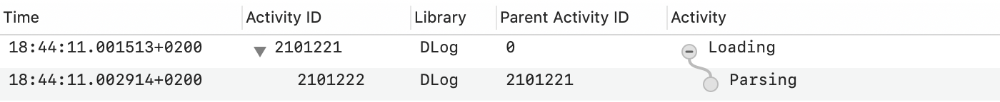

# DLog

[](https://developer.apple.com/swift)

[](https://swift.org/package-manager/)
[](https://github.com/ikhvorost/DLog/actions/workflows/swift.yml)
[](https://codecov.io/gh/ikhvorost/DLog)
[](https://github.com/SwiftDocOrg/swift-doc)

[](https://www.paypal.com/donate/?hosted_button_id=TSPDD3ZAAH24C)

<p align="center">


</p>

DLog is the development logger for Swift that supports emoji and colored text output, format and privacy options, pipelines, filtering, scopes, intervals, stack backtrace and more.

- [Getting started](#getting-started)
- [Log levels](#log-levels): [log](#log), [info](#info), [trace](#trace), [debug](#debug), [warning](#warning), [error](#error), [assert](#assert), [fault](#fault)
- [Privacy](#privacy): [public](#public), [private](#private)
- [Formatters](#formatters): [Date](#date), [Integer](#integer), [Float](#float), [Bool](#bool), [Data](#data)
- [Scope](#scope)
- [Interval](#interval)
- [Category](#category)
- [Outputs](#outputs): [Text](#text), [Standard](#standard), [File](#file), [OSLog](#oslog), [Net](#net)
- [Pipeline](#pipeline)
- [Filter](#filter)
- [.disabled](#disabled)
- [Configuration](#configuration): [TraceConfig](#traceconfig), [ThreadConfig](#threadconfig), [StackConfig](#stackconfig), [IntervalConfig](#intervalconfig)
- [Objective-C](#objective-c)
- [Installation](#installation)
- [License](#license)

## Getting started

By default `DLog` provides basic text console output:

```swift
// Import DLog package
import DLog

// Create the logger
let logger = DLog()

// Log a message
logger.log("Hello DLog!")
```

Outputs:

```
• 23:59:11.710 [DLOG] [LOG] <DLog.swift:12> Hello DLog!
```

Where:
- `•` - start sign (useful for filtering)
- `23:59:11.710` - timestamp (HH:mm:ss.SSS)
- `[DLOG]` - category tag ('DLOG' by default)
- `[LOG]` - log type tag
- `<DLog.swift:12>` - location (fileName:line), without file extension
- `Hello DLog!` - message

You can apply privacy and format options to your logged values:

```swift
let cardNumber = "1234 5678 9012 3456"
logger.debug("\(cardNumber, privacy: .private(mask: .redact))")

let salary = 10_123
logger.debug("\(salary, format: .number(style: .currency))")
```

Outputs:

```
• 12:20:29.462 [DLOG] [DEBUG] <DLogTests.swift:539> 0000 0000 0000 0000
• 12:20:29.464 [DLOG] [DEBUG] <DLogTests.swift:542> $10,123.00
```

`DLog` outputs text logs to `stdout` by default but you can use the other outputs such as: `stderr`, filter, file, OSLog, Net. For instance:

```swift
let logger = DLog(.file("path/dlog.txt"))
logger.debug("It's a file log!")
```

`Dlog` supports plain (by default), emoji and colored styles for text messages and you can set a needed one:

```swift
let logger = DLog(.textEmoji => .stdout)

logger.info("Info message")
logger.log("Log message")
logger.assert(false, "Assert message")
```

Outputs:

```
• 00:03:07.179 [DLOG] ✅ [INFO] <DLog.swift:6> Info message
• 00:03:07.181 [DLOG] 💬 [LOG] <DLog.swift:7> Log message
• 00:03:07.181 [DLOG] 🅰️ [ASSERT] <DLog.swift:8> Assert message
```

Where `=>` is pipeline operator and it can be used for creating a list of outputs:

```swift
let logger = DLog(.textEmoji
    => .stdout
    => .filter { $0.type == .error }
    => .file("path/error.log"))
```

All log messages will be written to `stdout` first and the the error messages only to the file.

## Log levels

### `log`

Log a message:

```swift
logger.log("App start")
```

Outputs:

```
• 23:40:23.545 [DLOG] [LOG] <DLog.swift:12> App start
```

### `info`

Log an information message and helpful data:

```swift
let uuid = UUID().uuidString
logger.info("uuid: \(uuid)")
```

Outputs:

```
• 23:44:30.702 [DLOG] [INFO] <DLog.swift:13> uuid: 8A71D2B9-29F1-4330-A4C2-69988E3FE172
```

### `trace`

Log the current function name and a message (if it is provided) to help in debugging problems during the development:

```swift
func startup() {
    logger.trace("Start")
    logger.trace()
}

startup()
```

Outputs:

```
• 23:45:31.198 [DLOG] [TRACE] <DLog.swift:13> Start: { func: startup(), thread: { number: 1, name: main } }
• 23:45:31.216 [DLOG] [TRACE] <DLog.swift:14> func: startup(), thread: { number: 1, name: main }
```

### `debug`

Log a debug message to help debug problems during the development:

```swift
let session = URLSession(configuration: .default)
session.dataTask(with: URL(string: "https://apple.com")!) { data, response, error in
    guard let http = response as? HTTPURLResponse else { return }

    let text = HTTPURLResponse.localizedString(forStatusCode: http.statusCode)
    logger.debug("\(http.url!.absoluteString): \(http.statusCode) - \(text)")
}
.resume()
```

Outputs:

```
• 23:49:16.562 [DLOG] [DEBUG] <DLog.swift:17> https://www.apple.com/: 200 - no error
```

### `warning`

Log a warning message that occurred during the execution of your code.

```swift
logger.warning("No Internet connection.")
```

Outputs:

```
• 23:49:55.757 [DLOG] [WARNING] <DLog.swift:12> No Internet connection.
```

### `error`

Log an error that occurred during the execution of your code.

```swift
let fromURL = URL(fileURLWithPath: "source.txt")
let toURL = URL(fileURLWithPath: "destination.txt")
do {
    try FileManager.default.moveItem(at: fromURL, to: toURL)
}
catch {
    logger.error(error.localizedDescription)
}
```

Outputs:

```
• 23:50:39.560 [DLOG] [ERROR] <DLog.swift:18> “source.txt” couldn’t be moved to “Macintosh HD” because either the former doesn’t exist, or the folder containing the latter doesn’t exist.
```

### `assert`

Sanity check and log a message (if it is provided) when a condition is false.

```swift
let user = "John"
let password = ""

logger.assert(user.isEmpty == false, "User is empty")
logger.assert(password.isEmpty == false)
logger.assert(password.isEmpty == false, "Password is empty")
```

Outputs:

```
• 23:54:19.420 [DLOG] [ASSERT] <DLog.swift:16>
• 23:54:19.422 [DLOG] [ASSERT] <DLog.swift:17> Password is empty

```

### `fault`

Log a critical bug that occurred during the execution in your code.

```swift
guard let modelURL = Bundle.main.url(forResource: "DataModel", withExtension:"momd") else {
    logger.fault("Error loading model from bundle")
    abort()
}
```

Outputs:

```
• 23:55:07.445 [DLOG] [FAULT] <DLog.swift:13> Error loading model from bundle
```

## Privacy

Privacy options allow to manage the visibility of values in log messages.

### `public`

It applies to all values in log messages by default and the values will be visible in logs.

```swift
let phoneNumber = "+11234567890"
logger.log("\(phoneNumber)") // public by default
logger.log("\(phoneNumber, privacy: .public)")
```

Outputs:

```
• 20:16:18.628 [DLOG] [LOG] <DLogTests.swift:481> +11234567890
• 20:16:18.629 [DLOG] [LOG] <DLogTests.swift:482> +11234567890
```

### `private`

Because users can have access to log messages that your app generates, use the `private` privacy options to hide potentially sensitive information. For example, you might use it to hide or mask an account information or personal data.

The standard `private` option redacts a value with the generic string.

```swift
let phoneNumber = "+11234567890"
logger.log("\(phoneNumber, privacy: .private)")
```

Outputs:

```
• 12:04:29.758 [DLOG] [LOG] <DLogTests.swift:508> <private>
```

> NOTE: DLog logs the data with `private` option as `public` when the XCode debugger is attached.

#### `private(mask: .hash)`

The mask option to redact a value with its hash value in the logs.

```swift
logger.log("\(phoneNumber, privacy: .private(mask: .hash))")
```

Outputs:

```
• 12:09:14.892 [DLOG] [LOG] <DLogTests.swift:508> ECD0ACC2
```

#### `private(mask: .random)`

The mask option to redact a value with a random values for each symbol in the logs.

```swift
logger.log("\(phoneNumber, privacy: .private(mask: .random))")
```

Outputs:

```
• 12:16:19.109 [DLOG] [LOG] <DLogTests.swift:508> =15277829896
```

#### `private(mask: .redact)`

The mask option to redact a value with a generic values for each symbol in the logs.

```swift
logger.log("\(phoneNumber, privacy: .private(mask: .redact))")
```

Outputs:

```
• 12:20:02.217 [DLOG] [LOG] <DLogTests.swift:508> +00000000000
```

#### `private(mask: .shuffle)`

The mask option to redact a value with a shuffled value from all symbols in the logs.

```swift
logger.log("\(phoneNumber, privacy: .private(mask: .shuffle))")
```

Outputs:

```
• 12:23:01.864 [DLOG] [LOG] <DLogTests.swift:508> 47681901+352
```

#### `private(mask: .custom(value:))`

The mask option to redact a value with a custom string value in the logs.

```swift
logger.log("\(phoneNumber, privacy: .private(mask: .custom(value: "<phone>")))")
```

Outputs:

```
• 12:28:55.105 [DLOG] [LOG] <DLogTests.swift:508> <phone>
```

#### `private(mask: .reduce(length:))`

The mask option to redact a value with its reduced value of a provided length in the logs.

```swift
logger.log("\(phoneNumber, privacy: .private(mask: .reduce(length: 5)))")
```

Outputs:

```
• 12:30:48.076 [DLOG] [LOG] <DLogTests.swift:508> +1...890
```

#### `private(mask: .partial(first:, last:))`

The mask option to redact a value with its parts from start and end of provided lengths in the logs.

```swift
logger.log("\(phoneNumber, privacy: .private(mask: .partial(first: 2, last: 1)))")
```

Outputs:

```
• 12:36:58.950 [DLOG] [LOG] <DLogTests.swift:508> +1*********0
```

## Formatters

DLog formats values in log messages based on the default settings, but you can apply custom formatting to your variables to make them more readable.

### Date

The formatting options for date values.

#### `date(dateStyle: DateFormatter.Style, timeStyle: DateFormatter.Style, locale: Locale?)`

The formatting options for Date values.

```swift
let date = Date()
logger.log("\(date, format: .date(dateStyle: .medium))")
logger.log("\(date, format: .date(timeStyle: .short))")
logger.log("\(date, format: .date(dateStyle: .medium, timeStyle: .short))")
logger.log("\(date, format: .date(dateStyle: .medium, timeStyle: .short, locale: Locale(identifier: "en_GB")))")
```

Outputs:

```
• 18:12:52.604 [DLOG] [LOG] <DLogTests.swift:555> Mar 30, 2022
• 18:12:52.605 [DLOG] [LOG] <DLogTests.swift:556> 6:12 PM
• 18:12:52.606 [DLOG] [LOG] <DLogTests.swift:557> Mar 30, 2022 at 6:12 PM
• 18:12:52.606 [DLOG] [LOG] <DLogTests.swift:559> 30 Mar 2022 at 18:12
```

#### `dateCustom(format: String)`

Format date with a custom format string.

```swift
let date = Date()
logger.log("\(date, format: .dateCustom(format: "dd-MM-yyyy"))")
```

Outputs:

```
• 18:12:52.606 [DLOG] [LOG] <DLogTests.swift:558> 30-03-2022
```

### Integer

The formatting options for integer (Int8, Int16, Int32, Int64, UInt8 etc.) values.

#### `binary`

Displays an integer value in binary format.

```swift
let value = 12345
logger.log("\(value, format: .binary)")
```

Outputs:

```
• 18:58:29.085 [DLOG] [LOG] <DLogTests.swift:621> 11000000111001
```

#### `octal(includePrefix: Bool)`

Displays an integer value in octal format with the specified parameters.

```swift
let value = 12345
logger.log("\(value, format: .octal)")
logger.log("\(value, format: .octal(includePrefix: true))")
```

Outputs:

```
• 19:01:33.019 [DLOG] [LOG] <DLogTests.swift:624> 30071
• 19:01:33.020 [DLOG] [LOG] <DLogTests.swift:625> 0o30071
```

#### `hex(includePrefix: Bool, uppercase: Bool)`

Displays an integer value in hexadecimal format with the specified parameters.

```swift
let value = 1234567
logger.log("\(value, format: .hex)")
logger.log("\(value, format: .hex(includePrefix: true))")
logger.log("\(value, format: .hex(uppercase: true))")
logger.log("\(value, format: .hex(includePrefix: true, uppercase: true))")
```

Outputs:

```
• 19:06:30.463 [DLOG] [LOG] <DLogTests.swift:621> 12d687
• 19:06:30.464 [DLOG] [LOG] <DLogTests.swift:622> 0x12d687
• 19:06:30.464 [DLOG] [LOG] <DLogTests.swift:623> 12D687
• 19:06:30.464 [DLOG] [LOG] <DLogTests.swift:624> 0x12D687
```

#### `byteCount(countStyle: ByteCountFormatter.CountStyle, allowedUnits: ByteCountFormatter.Units)`

Format byte count with style and unit.

```swift
let value = 20_234_557
logger.log("\(value, format: .byteCount)")
logger.log("\(value, format: .byteCount(countStyle: .memory))")
logger.log("\(value, format: .byteCount(allowedUnits: .useBytes))")
logger.log("\(value, format: .byteCount(countStyle: .memory, allowedUnits: .useGB))")
```

Outputs:

```
• 19:36:49.454 [DLOG] [LOG] <DLogTests.swift:621> 20.2 MB
• 19:36:49.458 [DLOG] [LOG] <DLogTests.swift:622> 19.3 MB
• 19:36:49.458 [DLOG] [LOG] <DLogTests.swift:623> 20,234,557 bytes
• 19:36:49.458 [DLOG] [LOG] <DLogTests.swift:624> 0.02 GB
```

#### `number(style: NumberFormatter.Style, locale: Locale?)`

Displays an integer value in number format with the specified parameters.

```swift
let number = 1_234
logger.log("\(number, format: .number)")
logger.log("\(number, format: .number(style: .currency))")
logger.log("\(number, format: .number(style: .spellOut))")
logger.log("\(number, format: .number(style: .currency, locale: Locale(identifier: "en_GB")))")
```

Outputs:

```
• 19:42:40.938 [DLOG] [LOG] <DLogTests.swift:621> 1,234
• 19:42:40.939 [DLOG] [LOG] <DLogTests.swift:622> $1,234.00
• 19:42:40.939 [DLOG] [LOG] <DLogTests.swift:623> one thousand two hundred thirty-four
• 19:42:40.939 [DLOG] [LOG] <DLogTests.swift:624> £1,234.00
```

#### `httpStatusCode`

Displays a localized string corresponding to a specified HTTP status code.

```swift
logger.log("\(200, format: .httpStatusCode)")
logger.log("\(404, format: .httpStatusCode)")
logger.log("\(500, format: .httpStatusCode)")
```

Outputs:

```
• 19:51:14.297 [DLOG] [LOG] <DLogTests.swift:620> HTTP 200 no error
• 19:51:14.298 [DLOG] [LOG] <DLogTests.swift:621> HTTP 404 not found
• 19:51:14.298 [DLOG] [LOG] <DLogTests.swift:622> HTTP 500 internal server error
```

#### `ipv4Address`

Displays an integer value (Int32) as IPv4 address.

```swift
let ip4 = 0x0100007f
logger.log("\(ip4, format: .ipv4Address)")
```

Outputs:

```
• 19:53:18.141 [DLOG] [LOG] <DLogTests.swift:621> 127.0.0.1
```

#### time(unitsStyle: DateComponentsFormatter.UnitsStyle)

Displays a time duration from seconds.

```swift
let time = 60 * 60 + 23 * 60 + 15 // 1h 23m 15s
logger.log("\(time, format: .time)")
logger.log("\(time, format: .time(unitsStyle: .positional))")
logger.log("\(time, format: .time(unitsStyle: .short))")
```

Outputs:

```
• 12:56:39.655 [DLOG] [LOG] <DLogTests.swift:624> 1h 23m 15s
• 12:56:39.657 [DLOG] [LOG] <DLogTests.swift:625> 1:23:15
• 12:56:39.657 [DLOG] [LOG] <DLogTests.swift:626> 1 hr, 23 min, 15 secs
```

#### date(dateStyle: DateFormatter.Style, timeStyle: DateFormatter.Style, locale: Locale?)

Displays date from seconds since 1970.

```swift
let timeIntervalSince1970 = 1645026131 // 2022-02-16 15:42:11 +0000
logger.log("\(timeIntervalSince1970, format: .date)")
logger.log("\(timeIntervalSince1970, format: .date(dateStyle: .short))")
logger.log("\(timeIntervalSince1970, format: .date(timeStyle: .medium))")
```

Outputs:

```
• 13:00:33.964 [DLOG] [LOG] <DLogTests.swift:624> 2/16/22, 3:42 PM
• 13:00:33.965 [DLOG] [LOG] <DLogTests.swift:625> 2/16/22
• 13:00:33.966 [DLOG] [LOG] <DLogTests.swift:626> 3:42:11 PM
```

### Float

The formatting options for double and floating-point numbers.

#### `fixed(precision: Int)`

Displays a floating-point value in fprintf's `%f` format with specified precision.

```swift
let value = 12.345
logger.log("\(value, format: .fixed)")
logger.log("\(value, format: .fixed(precision: 2))")
```

Outputs:

```
• 08:49:35.800 [DLOG] [LOG] <DLogTests.swift:696> 12.345000
• 08:49:35.802 [DLOG] [LOG] <DLogTests.swift:697> 12.35
```

#### `hex(includePrefix: Bool, uppercase: Bool)`

Displays a floating-point value in hexadecimal format with the specified parameters.

```swift
let value = 12.345
logger.log("\(value, format: .hex)")
logger.log("\(value, format: .hex(includePrefix: true))")
logger.log("\(value, format: .hex(uppercase: true))")
logger.log("\(value, format: .hex(includePrefix: true, uppercase: true))")
```

Outputs:

```
• 09:25:46.834 [DLOG] [LOG] <DLogTests.swift:697> 1.8b0a3d70a3d71p+3
• 09:25:46.836 [DLOG] [LOG] <DLogTests.swift:698> 0x1.8b0a3d70a3d71p+3
• 09:25:46.836 [DLOG] [LOG] <DLogTests.swift:699> 1.8B0A3D70A3D71P+3
• 09:25:46.836 [DLOG] [LOG] <DLogTests.swift:700> 0x1.8B0A3D70A3D71P+3
```

#### `exponential(precision: Int)`

Displays a floating-point value in fprintf's `%e` format with specified precision.

```swift
let value = 12.345
logger.log("\(value, format: .exponential)")
logger.log("\(value, format: .exponential(precision: 2))")
```

Outputs:

```
• 09:28:51.684 [DLOG] [LOG] <DLogTests.swift:696> 1.234500e+01
• 09:28:51.686 [DLOG] [LOG] <DLogTests.swift:697> 1.23e+01
```

#### `hybrid(precision: Int)`

Displays a floating-point value in fprintf's `%g` format with the specified precision.

```swift
let value = 12.345
logger.log("\(value, format: .hybrid)")
logger.log("\(value, format: .hybrid(precision: 1))")
```

Outputs:

```
• 09:31:02.301 [DLOG] [LOG] <DLogTests.swift:696> 12.345
• 09:31:02.303 [DLOG] [LOG] <DLogTests.swift:697> 1e+01
```

#### `number(style: NumberFormatter.Style, locale: Locale?)`

Displays a floating-point value in number format with the specified parameters.

```swift
let value = 12.345
logger.log("\(value, format: .number)")
logger.log("\(value, format: .number(style: .currency))")
logger.log("\(value, format: .number(style: .spellOut))")
logger.log("\(value, format: .number(style: .currency, locale: Locale(identifier: "en_GB")))")
```

Outputs:

```
• 09:35:00.740 [DLOG] [LOG] <DLogTests.swift:696> 12.345
• 09:35:00.741 [DLOG] [LOG] <DLogTests.swift:697> $12.34
• 09:35:00.741 [DLOG] [LOG] <DLogTests.swift:698> twelve point three four five
• 09:35:00.744 [DLOG] [LOG] <DLogTests.swift:699> £12.34
```

#### time(unitsStyle: DateComponentsFormatter.UnitsStyle)

Displays a time duration from seconds.

```swift
let time = 60 * 60 + 23 * 60 + 1.25 // 1m 23m 1.25s
logger.log("\(time, format: .time)")
logger.log("\(time, format: .time(unitsStyle: .positional))")
logger.log("\(time, format: .time(unitsStyle: .short))")
```

Outputs:

```
• 13:06:29.874 [DLOG] [LOG] <DLogTests.swift:714> 1h 23m 1.250s
• 13:06:29.877 [DLOG] [LOG] <DLogTests.swift:715> 1:23:01.250
• 13:06:29.878 [DLOG] [LOG] <DLogTests.swift:716> 1 hr, 23 min, 1.250 sec
```

#### date(dateStyle: DateFormatter.Style, timeStyle: DateFormatter.Style, locale: Locale?)

Displays date from seconds since 1970.

```swift
let timeIntervalSince1970 = 1645026131.45 // 2022-02-16 15:42:11 +0000
logger.log("\(timeIntervalSince1970, format: .date)")
logger.log("\(timeIntervalSince1970, format: .date(dateStyle: .short))")
logger.log("\(timeIntervalSince1970, format: .date(timeStyle: .medium))")
```

Outputs:

```
• 13:09:51.299 [DLOG] [LOG] <DLogTests.swift:714> 2/16/22, 3:42 PM
• 13:09:51.300 [DLOG] [LOG] <DLogTests.swift:715> 2/16/22
• 13:09:51.301 [DLOG] [LOG] <DLogTests.swift:716> 3:42:11 PM
```

### Bool

The formatting options for Boolean values.

#### `binary`

Displays a boolean value as 1 or 0.

```swift
let value = true
logger.log("\(value, format: .binary)")
logger.log("\(!value, format: .binary)")
```

Outputs:

```
• 09:41:38.368 [DLOG] [LOG] <DLogTests.swift:746> 1
• 09:41:38.370 [DLOG] [LOG] <DLogTests.swift:747> 0
```

#### `answer`

Displays a boolean value as yes or no.

```swift
let value = true
logger.log("\(value, format: .answer)")
logger.log("\(!value, format: .answer)")
```

Outputs:

```
• 09:42:57.414 [DLOG] [LOG] <DLogTests.swift:746> yes
• 09:42:57.415 [DLOG] [LOG] <DLogTests.swift:747> no
```

#### `toggle`

Displays a boolean value as on or off.

```swift
let value = true
logger.log("\(value, format: .toggle)")
logger.log("\(!value, format: .toggle)")
```

Outputs:

```
• 09:43:46.202 [DLOG] [LOG] <DLogTests.swift:746> on
• 09:43:46.203 [DLOG] [LOG] <DLogTests.swift:747> off
```

### Data

The formatting options for Data.

#### ipv6Address

Pretty prints an IPv6 address from data.

```swift
let data = Data([0x20, 0x01, 0x0b, 0x28, 0xf2, 0x3f, 0xf0, 0x05, 0x00, 0x00, 0x00, 0x00, 0x00, 0x00, 0x00, 0x0a])
logger.log("\(data, format: .ipv6Address)")
```

Outputs:

```
• 13:24:50.534 [DLOG] [LOG] <DLogTests.swift:813> 2001:b28:f23f:f005::a
```

#### text

Pretty prints text from data.

```swift
let data = Data([0x48, 0x65, 0x6c, 0x6c, 0x6f, 0x20, 0x44, 0x4c, 0x6f, 0x67, 0x21])
logger.log("\(data, format: .text)")
```

Outputs:

```
• 13:31:37.596 [DLOG] [LOG] <DLogTests.swift:813> Hello DLog!
```

#### uuid

Pretty prints uuid from data.

```swift
let data = Data([0xca, 0xcd, 0x1b, 0x9d, 0x56, 0xaa, 0x41, 0xf0, 0xbd, 0xe3, 0x45, 0x7d, 0xda, 0x30, 0xa8, 0xd4])
logger.log("\(data, format: .uuid)")
```

Outputs:

```
• 14:41:26.818 [DLOG] [LOG] <DLogTests.swift:815> CACD1B9D-56AA-41F0-BDE3-457DDA30A8D4
```

#### raw

Pretty prints raw bytes from data.

```swift
let data = Data([0xab, 0xcd, 0xef])
logger.log("\(data, format: .raw)")
```

Outputs:

```
• 14:42:52.795 [DLOG] [LOG] <DLogTests.swift:815> ABCDEF
```

## Scope

`scope` provides a mechanism for grouping work that's done in your program, so that can see all log messages related to a defined scope of your code in a tree view:

```swift
logger.scope("Loading") { scope in
    if let path = Bundle.main.path(forResource: "data", ofType: "json") {
        scope.info("File: \(path)")
        if let data = try? String(contentsOfFile: path) {
            scope.debug("Loaded \(data.count) bytes")
        }
    }
}
```

> NOTE: To pin your messages to a needed scope you should use the provided parameter of the closure that is scope logger.

Outputs:

```
• 23:57:13.410 [DLOG] ┌ [Loading]
• 23:57:13.427 [DLOG] | [INFO] <DLog.swift:14> File: path/data.json
• 23:57:13.443 [DLOG] | [DEBUG] <DLog.swift:16> Loaded 121 bytes
• 23:57:13.443 [DLOG] └ [Loading] (0.330s)

```

Where:
 - `[Loading]` - a name of the scope
 - `(0.330s)` - a time duration of the scope in secs

You can get duration value of a finished scope programatically:

```swift
var scope = logger.scope("scope") { _ in
    ...
}

print(scope.duration)
```

It's possible to `enter` and `leave` a scope asynchronously:

```swift
let scope = logger.scope("Request")
scope.enter()

let session = URLSession(configuration: .default)
session.dataTask(with: URL(string: "https://apple.com")!) { data, response, error in
    defer {
        scope.leave()
    }

    guard let data = data, let http = response as? HTTPURLResponse else {
        return
    }

    scope.debug("\(http.url!.absoluteString) - HTTP \(http.statusCode)")
    scope.debug("Loaded: \(data.count) bytes")
}
.resume()
```

Outputs:

```
• 00:01:24.158 [DLOG] ┌ [Request]
• 00:01:24.829 [DLOG] | [DEBUG] <DLog.swift:25> https://www.apple.com/ - HTTP 200
• 00:01:24.830 [DLOG] | [DEBUG] <DLog.swift:26> Loaded: 74454 bytes
• 00:01:24.830 [DLOG] └ [Request] (0.671s)
```

Scopes can be nested one into one and that implements a global stack of scopes:

```swift
logger.scope("Loading") { scope1 in
    if let url = Bundle.main.url(forResource: "data", withExtension: "json") {
        scope1.info("File: \(url)")

        if let data = try? Data(contentsOf: url) {
            scope1.debug("Loaded \(data.count) bytes")

            logger.scope("Parsing") { scope2 in
                if let items = try? JSONDecoder().decode([Item].self, from: data) {
                    scope2.debug("Parsed \(items.count) items")
                }
            }
        }
    }
}
```

Outputs:

```
• 00:03:13.552 [DLOG] ┌ [Loading]
• 00:03:13.554 [DLOG] | [INFO] <DLog.swift:20> File: file:///path/data.json
• 00:03:13.555 [DLOG] | [DEBUG] <DLog.swift:23> Loaded 121 bytes
• 00:03:13.555 [DLOG] | ┌ [Parsing]
• 00:03:13.557 [DLOG] | | [DEBUG] <DLog.swift:27> Parsed 3 items
• 00:03:13.557 [DLOG] | └ [Parsing] (0.200s)
• 00:03:13.609 [DLOG] └ [Loading] (0.560s)
```

## Interval

`interval` measures performance of your code by a running time and logs a detailed message with accumulated statistics in seconds:

```swift
for _ in 0..<10 {
    logger.interval("Sort") {
        var arr = (1...10000).map {_ in arc4random()}
        arr.sort()
    }
}
```

Outputs:

```
• 00:05:09.932 [DLOG] [INTERVAL] <DLog.swift:19> Sort: { duration: 0.270s, average: 0.270s }
• 00:05:10.162 [DLOG] [INTERVAL] <DLog.swift:19> Sort: { duration: 0.216s, average: 0.243s }
• 00:05:10.380 [DLOG] [INTERVAL] <DLog.swift:19> Sort: { duration: 0.215s, average: 0.234s }
• 00:05:10.608 [DLOG] [INTERVAL] <DLog.swift:19> Sort: { duration: 0.225s, average: 0.231s }
• 00:05:10.829 [DLOG] [INTERVAL] <DLog.swift:19> Sort: { duration: 0.217s, average: 0.229s }
• 00:05:11.057 [DLOG] [INTERVAL] <DLog.swift:19> Sort: { duration: 0.225s, average: 0.228s }
• 00:05:11.275 [DLOG] [INTERVAL] <DLog.swift:19> Sort: { duration: 0.214s, average: 0.226s }
• 00:05:11.497 [DLOG] [INTERVAL] <DLog.swift:19> Sort: { duration: 0.219s, average: 0.225s }
• 00:05:11.712 [DLOG] [INTERVAL] <DLog.swift:19> Sort: { duration: 0.212s, average: 0.224s }
```

Where:
 - `Sort` - a name of the interval
 - `duration` - the current time duration
 - `average` - an average time duration

You can get all metrics values of the interval programatically:

```swift
let interval = logger.interval("signpost") {
    ...
}

print(interval.count)
print(interval.duration)
print(interval.total)
print(interval.min)
print(interval.max)
print(interval.avg)
```

To measure asynchronous tasks you can use `begin` and `end` methods:

```swift
let interval = logger.interval("Video")
interval.begin()

let asset = AVURLAsset(url: url)
asset.loadValuesAsynchronously(forKeys: ["duration"]) {
    let status = asset.statusOfValue(forKey: "duration", error: nil)
    if status == .loaded {
        logger.info("Duration: \(asset.duration.value)")
    }
    interval.end()
}
```

Outputs:

```
• 00:10:17.982 [DLOG] [INFO] <DLog.swift:27> Duration: 5532776
• 00:10:17.983 [DLOG] [INTERVAL] <DLog.swift:20> Video: { duration: 2.376s, average: 2.376s }
```

## Category

You can define category name to differentiate unique areas and parts of your app and DLog uses this value to categorize and filter related log messages. For example, you might define separate strings for your app’s user interface, data model, and networking code.

```swift
let logger = DLog()
let tableLogger = logger["TABLE"]
let netLogger = logger["NET"]

logger.debug("Refresh")
netLogger.debug("Successfully fetched recordings.")
tableLogger.debug("Updating with network response.")
```

Outputs:

```
• 00:11:30.660 [DLOG] [DEBUG] <DLog.swift:22> Refresh
• 00:11:30.661 [NET] [DEBUG] <DLog.swift:23> Successfully fetched recordings.
• 00:11:30.661 [TABLE] [DEBUG] <DLog.swift:24> Updating with network response.
```

**Configuration**

You can apply your specific configuration to your category to change the default log messages appearance, visible info and details etc. (See more: [Configuration](#configuration) )

For instance:

```swift
let logger = DLog()

var config = LogConfig()
config.sign = ">"
config.options = [.sign, .time, .category, .type]
config.traceConfig.options = [.queue]

let netLogger = logger.category(name: "NET", config: config)

logger.trace("default")
netLogger.trace("net")
```

Outputs:
```
• 13:31:43.773 [DLOG] [TRACE] <DLogTests.swift:487> default: { func: test_Config(), thread: { number: 1, name: main } }
> 13:31:43.775 [NET] [TRACE] net: { queue: com.apple.main-thread }
```

## Outputs

### Text

`Text` is a source output that generates text representation of log messages. It doesn't deliver text to any target outputs (stdout, file etc.) and usually other outputs use it.

It supports thee styles:
- `.plain` - universal plain text
- `.emoji` - text with type icons for info, debug etc. (useful for XCode console)
- `.colored` - colored text with ANSI escape codes (useful for Terminal and files)

```swift
let outputs = [
    "Plain" : Text(style: .plain),
    "Emoji" : Text(style: .emoji),
    "Colored" : Text(style: .colored),
]

for (name, output) in outputs {
    let logger = DLog(output)

    print(name)
    print(logger.info("info")!)
    print(logger.error("error")!)
    print(logger.fault("fatal")!)
    print("")
}
```

Outputs:

```
Plain
• 00:12:31.718 [DLOG] [INFO] <DLog.swift:25> info
• 00:12:31.719 [DLOG] [ERROR] <DLog.swift:26> error
• 00:12:31.720 [DLOG] [FAULT] <DLog.swift:27> fatal

Emoji
• 00:12:31.720 [DLOG] ✅ [INFO] <DLog.swift:25> info
• 00:12:31.721 [DLOG] ⚠️ [ERROR] <DLog.swift:26> error
• 00:12:31.734 [DLOG] 🆘 [FAULT] <DLog.swift:27> fatal

Colored
• 00:12:31.735 DLOG  INFO  <DLog.swift:25> info
• 00:12:31.735 DLOG  ERROR  <DLog.swift:26> error
• 00:12:31.735 DLOG  FAULT  <DLog.swift:27> fatal
```

Colored text in Terminal:

<br>

You can also use shortcuts `.textPlain`, `.textEmoji` and `.textColored` to create the output:

```swift
let logger = DLog(.textEmoji)
```

### Standard

`Standard` is a target output that can output text messages to POSIX streams:
- `stdout` - Standard Output
- `stderr` - Standard Error

```swift
// Prints to stdout
let loggerOut = DLog(Standard())

// Prints to stderr
let loggerErr = DLog(Standard(stream: Darwin.stderr))
```

You can also use shortcuts `.stdout` and `.stderr` to create the output for the logger:

```swift
let logger = DLog(.stderr)
logger.info("It's error stream")
```

By default `Standard` uses `Text(style: .plain)` output as a source to write text to the streams but you can set other:

```swift
let output = Standard(source: .textEmoji)
let logger = DLog(output)

logger.info("Emoji")
```

Outputs:

```
• 00:15:25.602 [DLOG] ✅ [INFO] <DLog.swift:18> Emoji
```

### File

`File` is a target output that writes text messages to a file by a provided path:

```swift
let file = File(path: "/users/user/dlog.txt")
let logger = DLog(file)

logger.info("It's a file")
```

By default `File` output clears content of a opened file but if you want to append data to the existed file you should set `append` parameter to `true`:

```swift
let file = File(path: "/users/user/dlog.txt", append: true)
```

You can also use `.file` shortcut to create the output:

```swift
let logger = DLog(.file("dlog.txt"))
```

`File` output uses `Text(style: .plain)` as a source by default but you can change it:

```swift
let file = File(path: "/users/user/dlog.txt", source: .textColored)
let logger = DLog(file)

logger.scope("File") { scope in
    scope.info("It's a file")
}
```
File "dlog.txt":

<br>

### OSLog

`OSLog` is a target output that writes messages to the Unified Logging System (https://developer.apple.com/documentation/os/logging) that captures telemetry from your app for debugging and performance analysis and then you can use various tools to retrieve log information such as: `Console` and `Instruments` apps, command line tool `log` etc.

To create `OSLog` you can use subsystem strings that identify major functional areas of your app, and you specify them in reverse DNS notation—for example, `com.your_company.your_subsystem_name`. `OSLog` uses `com.dlog.logger` subsystem by default:

```swift
let output1 = OSLog() // subsystem = "com.dlog.logger"
let output2 = OSLog(subsystem: "com.company.app") // subsystem = "com.company.app"
```

You can also use `.oslog` shortcut to create the output:

```swift
let logger1 = DLog(.oslog)
let logger2 = DLog(.oslog("com.company.app"))
```

All DLog's methods map to the system logger ones with appropriate log levels e.g.:

```swift
let logger = DLog(.oslog)

logger.log("log")
logger.info("info")
logger.trace("trace")
logger.debug("debug")
logger.warning("warning")
logger.error("error")
logger.assert(false, "assert")
logger.fault("fault")
```

Console.app with log levels:

<br>

DLog's scopes map to the system logger activities:

```swift
let logger = DLog(.oslog)

logger.scope("Loading") { scope1 in
    scope1.info("start")
    logger.scope("Parsing") { scope2 in
        scope2.debug("Parsed 1000 items")
    }
    scope1.info("finish")
}
```

Console.app with activities:

<br>

DLog's intervals map to the system logger signposts:

```swift
let logger = DLog(.oslog)

for _ in 0..<10 {
    logger.interval("Sorting") {
        let delay = [0.1, 0.2, 0.3].randomElement()!
        Thread.sleep(forTimeInterval: delay)
        logger.debug("Sorted")
    }
}
```

Instruments.app with signposts:

<br>


### Net

`Net` is a target output that sends log messages to `NetConsole` service that can be run from a command line on your machine. The service is provided as executable inside DLog package and to start it you should run `sh NetConsole.command` (or just click on `NetConsole.command` file) inside the package's folder and then the service starts listening for incoming messages:

```sh
$ sh NetConsole.command # or 'xcrun --sdk macosx swift run'
> [39/39] Linking NetConsole
> NetConsole for DLog v.1.0
```

Then the output connects and sends your log messages to `NetConsole`:

```swift
let logger = DLog(Net())

logger.scope("Main") { scope1 in
    scope1.trace("Start")
    logger.scope("Subtask") { scope2 in
        scope2.info("Validation")
        scope2.error("Token is invalid")
        scope2.debug("Retry")
    }
    scope1.info("Close connection")
}
```

> **iOS 14**: Don't forget to make next changes in your Info.plist to support Bonjour:
> ```xml
> <key>NSLocalNetworkUsageDescription</key>
> <string>Looking for local tcp Bonjour  service</string>
> <key>NSBonjourServices</key>
> <array>
>     <string>_dlog._tcp</string>
> </array>
> ```

Terminal:
<p></p>


By default `Net` uses `Text(style: .colored)` output as a source but you can set other:

```swift
let logger = DLog(Net(source: .textEmoji))
```

And you can also use `.net` shortcut to create the output for the logger.

```swift
let logger = DLog(.net)
```

To connect to a specific instance of the service in your network you should provide an unique name to both `NetConsole` and `Net` output ("DLog" name is used by default).

To run the `NetConsole` with a specific name run next command:

```sh
sh NetConsole.command -n "MyLogger" # or 'xcrun --sdk macosx swift run NetConsole -n "MyLogger"'
```

In swift code you should set the same name:

```swift
let logger = DLog(.net("MyLogger"))
```

More params of `NetConsole` you can look at help:

```sh
sh NetConsole.command --help  # or 'xcrun --sdk macosx swift run NetConsole --help'
OVERVIEW: NetConsole for DLog v.1.0

USAGE: net-console [--name <name>] [--auto-clear] [--debug]

OPTIONS:
  -n, --name <name>       The name by which the service is identified to the network. The name must be unique and by default it equals
                          "DLog". If you pass the empty string (""), the system automatically advertises your service using the computer
                          name as the service name.
  -a, --auto-clear        Clear a terminal on new connection.
  -d, --debug             Enable debug messages.
  -h, --help              Show help information.
```

## Pipeline

As described above `File`, `Net` and `Standard` outputs have `source` parameter in their initializers to set a source output that is very useful if we want to change an output by default:

```swift
let std = Standard(stream: .out, source: .textEmoji)
let logger = DLog(std)
```

Actually any output has `source` property:

```swift
let std = Standard()
std.source = .textEmoji
let logger = DLog(std)
```

So that it's possible to make a linked list of outputs:

```swift
// Text
let text: LogOutput = .textEmoji

// Standard
let std = Standard()
std.source = text

// File
let file = File(path: "dlog.txt")
file.source = std

let logger = DLog(file)
```

Where `text` is a source for `std` and `std` is a source for `file`: text --> std --> file, and now each text message will be sent to both `std` and `file` outputs consecutive.

Lets rewrite this shorter:

```swift
let logger = DLog(.textEmoji => .stdout => .file("dlog.txt"))
```

Where `=>` is pipeline operator which defines a combined output from two outputs where the first one is a source and second is a target. So from example above emoji text messages will be written twice: first to standard output and then to the file.

You can combine any needed outputs together and create a final chained output from multiple outputs and your messages will be forwarded to all of them one by one:

```swift
// All log messages will be written:
// 1) as plain text to stdout
// 2) as colored text (with escape codes) to the file

let logger = DLog(.textPlain => .stdout => .textColored => .file(path))
```

## Filter

`Filter` or `.filter` represents a pipe output that can filter log messages by next available fields: `time`, `category`, `type`, `fileName`, `funcName`, `line`, `text` and `scope`. You can inject it to your pipeline where you need to log specific data only.

Examples:

1) Log messages to stardard output with 'NET' category only

```swift
let logger = DLog(.textPlain => .filter { $0.category == "NET" } => .stdout)
let netLogger = logger["NET"]

logger.info("info")
netLogger.info("info")
```

Outputs:

```
• 00:17:58.076 [NET] [INFO] <DLog.swift:19> info
```

2) Log debug messages only

```swift
let logger = DLog(.textPlain => .filter { $0.type == .debug } => .stdout)

logger.trace()
logger.info("info")
logger.debug("debug")
logger.error("error")
```

Outputs:

```
• 00:18:23.638 [DLOG] [DEBUG] <DLog.swift:19> debug
```

3) Log messages that contain "hello" string only

```swift
let logger = DLog(.textPlain => .filter { $0.text().contains("hello") } => .stdout)

logger.debug("debug")
logger.log("hello world")
logger.info("info")
```

Outputs:

```
• 00:19:17.821 [DLOG] [LOG] <DLog.swift:18> hello world
```

3) Log messages which are related to a specific scope:

```swift
let filter = Filter { item in
    let name = "Load"
    if let scope = item as? LogScope {
        return scope.text() == name
    }
    return item.scope?.text() == name
}

let logger = DLog(.textPlain => filter => .stdout)

logger.trace("trace")
logger.scope("Load") { scope1 in
    scope1.debug("debug")

    logger.scope("Parse") { scope2 in
        scope2.log("log")
        scope2.info("info")
    }

    scope1.error("error")
}
logger.fault("fault")
```

Outputs:

```
• 00:19:59.573 [DLOG] ┌ [Load]
• 00:19:59.573 [DLOG] | [DEBUG] <DLog.swift:27> debug
• 00:19:59.586 [DLOG] | [ERROR] <DLog.swift:34> error
• 00:19:59.586 [DLOG] └ [Load] (0.130s)
```

## `.disabled`

It is the shared disabled logger constant that doesn't emit any log message and it's very useful when you want to turn off the logger for some build configuration, preference, condition etc.

```swift
// Logging is enabled for `Debug` build configuration only

#if DEBUG
    let logger = DLog(.textPlain => .file(path))
#else
    let logger = DLog.disabled
#endif
```

The same can be done for disabling unnecessary log categories without commenting or deleting the logger's functions:

```swift
//let netLogger = log["NET"]
let netLogger = DLog.disabled // Disable "NET" category
```

The disabled logger continue running your code inside scopes and intervals:

```swift
let logger = DLog.disabled

logger.log("start")
logger.scope("scope") { scope in
    scope.debug("debug")

    print("scope code")
}
logger.interval("signpost") {
    logger.info("info")

    print("signpost code")
}
logger.log("finish")
```

Outputs:

```
scope code
signpost code
```

## Configuration

You can customize the logger's output by setting which info from the logger should be used. `LogConfig` is a root struct to configure the logger which contains common settings for log messages.

For instance you can change the default view of log messages which includes a start sign, category, log type and location:

```swift
let logger = DLog()
logger.info("Info message")
```

Outputs:

```
• 23:53:16.116 [DLOG] [INFO] <DLog.swift:12> Info message
```

To new appearance that includes your start sign and timestamp only:

```swift
var config = LogConfig()
config.sign = ">"
config.options = [.sign, .time]

let logger = DLog(config: config)

logger.info("Info message")
```

Outputs:

```
> 00:01:24.380 Info message
```

### `TraceConfig`

It contains configuration values regarding to the `trace` method which includes trace view options, thread and stack configurations.

By default `trace` method uses `.compact` view option to produce information about the current function name and thread info:

```swift
let logger = DLog()

func doTest() {
    logger.trace()
}

doTest()
```

Outputs:

```
• 12:20:47.137 [DLOG] [TRACE] <DLog.swift:13> func: doTest(), thread: { number: 1, name: main }
```

But you can change it to show a function and queue names:

```swift
var config = LogConfig()
config.traceConfig.options = [.function, .queue]

let logger = DLog(config: config)

func doTest() {
    logger.trace()
}

doTest()
```

Outputs:

```
• 12:37:24.101 [DLOG] [TRACE] <DLog.swift:11> func: doTest(), queue: com.apple.main-thread
```

#### `ThreadConfig`

The trace configuration has `threadConfig` property to change view options of thread info. For instance the logger can print the current QoS of threads.

```swift
var config = LogConfig()
config.traceConfig.threadConfig.options = [.number, .qos]

let logger = DLog(config: config)

func doTest() {
    logger.trace()
}

doTest()

DispatchQueue.global().async {
    doTest()
}
```

Outputs:

```
• 13:01:32.859 [DLOG] [TRACE] <DLog.swift:9> func: doTest(), thread: { number: 1, qos: userInteractive }
• 13:01:32.910 [DLOG] [TRACE] <DLog.swift:9> func: doTest(), thread: { number: 3, qos: userInitiated }
```

#### `StackConfig`

The `trace` method can output the call stack backtrace of the current thread at the moment this method was called. To enable this feature you should configure stack view options, style and depth with `stackConfig` property:

```swift
var config = LogConfig()
config.traceConfig.options = [.stack]
config.traceConfig.stackConfig.options = [.symbols]
config.traceConfig.stackConfig.style = .column
config.traceConfig.stackConfig.depth = 3

let logger = DLog(config: config)

func third() {
    logger.trace()
}

func second() {
    third()
}

func first() {
    second()
}

first()
```

Outputs:

```
• 23:06:24.092 [DLOG] [TRACE] <AppDelegate:45> stack: [
0: { symbols: Test.third() -> () }
1: { symbols: Test.second() -> () }
2: { symbols: Test.first() -> () } ]
```

> NOTE: A full call stack backtrace is available in Debug mode only.

### `IntervalConfig`

You can change the view options of interval statistics with `intervalConfig` property of `LogConfig` to show needed information such as: `.count`, `.min`, `.max` etc. Or you can use `.all` to output all parameters.

```swift
var config = LogConfig()
config.intervalConfig.options = [.all]

let logger = DLog(config: config)

logger.interval("signpost") {
    Thread.sleep(forTimeInterval: 3)
}
```

Outputs:

```
• 23:26:40.978 [DLOG] [INTERVAL] <DLog.swift:13> signpost: { duration: 3.200s, count: 1, total: 3.200s, min: 3.200s, max: 3.200s, average: 3.200s }
```

## Objective-C

DLog exposes all functionality to Objective-C via `DLogObjC` library and it's very useful in projects with mixed code so you can log messages, create scopes and intervals, share global loggers etc.

**Log levels**

``` objective-c
@import DLogObjC;

DLog* logger = [DLog new];

logger.log(@"log");
logger.trace(@"trace");
logger.debug(@"debug");
logger.info(@"info");
logger.warning(@"warning");
logger.error(@"error");
logger.assert(NO, @"assert");
logger.fault(@"fault");
```

Also you can format log messages:

``` objective-c
logger.info(@"Version: %@, build: %d", @"1.2.0", 123);
```

Output:

``` sh
• 20:54:48.348 [DLOG] [INFO] <Test.m:16> Version: 1.2.0, build: 123
```

**Scope**

``` objective-c
LogScope* scope = logger.scope(@"Scope1", ^(LogScope* scope) {
    scope.debug(@"debug1");
});

// OR

scope = logger.scope(@"Scope2");
[scope enter];
scope.debug(@"debug2");
[scope leave];
```

**Interval**

``` objective-c
LogInterval* interval = logger.interval(@"interval", ^{
    [NSThread sleepForTimeInterval:0.25];
});

// OR

[interval begin];
[NSThread sleepForTimeInterval:0.25];
[interval end];
```

**Category**

``` objective-c
LogProtocol* netLogger = logger[@"NET"];
netLogger.log(@"net logger");
```

**Pipeline**

``` objective-c
DLog* logger = [[DLog alloc] initWithOutputs:@[LogOutput.textEmoji, LogOutput.stdOut]];
logger.info(@"info");
```

Outputs:

```
• 14:17:07.306 [DLOG] ✅ [INFO] <Test.m:15> info
```

**Filter**

``` objective-c
// Debug messages only
LogOutput* filter = [LogOutput filter:^BOOL(LogItem* logItem) {
    return logItem.type == LogTypeDebug;
}];

DLog* logger = [[DLog alloc] initWithOutputs:@[LogOutput.textPlain, filter, LogOutput.stdOut]];
logger.log(@"log");
logger.info(@"info");
logger.debug(@"debug");
```

Outputs:

```
• 14:19:50.212 [DLOG] [DEBUG] <Test.m:21> debug
```

**Disabled**

``` objective-c
DLog* logger = DLog.disabled;
```

## Installation

### XCode project

1. Select `Xcode > File > Add Packages...`
2. Add package repository: `https://github.com/ikhvorost/DLog.git`
3. Import the package in your source files: `import DLog`

### Swift Package

Add `DLog` package dependency to your `Package.swift` file:

```swift
let package = Package(
    ...
    dependencies: [
        .package(url: "https://github.com/ikhvorost/DLog.git", from: "1.0.0")
    ],
    targets: [
        .target(name: "YourPackage",
            dependencies: [
                .product(name: "DLog", package: "DLog")
            ]
        ),
        ...
    ...
)
```

## License

DLog is available under the MIT license. See the [LICENSE](LICENSE) file for more info.

[](https://www.paypal.com/donate/?hosted_button_id=TSPDD3ZAAH24C)
