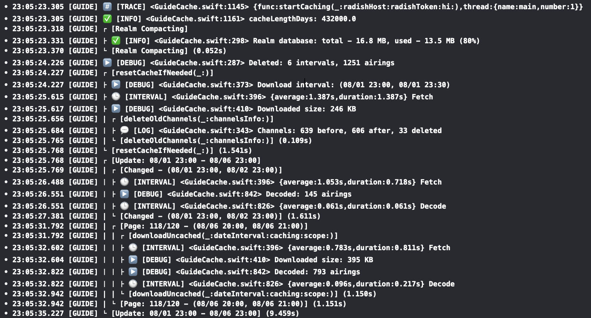

# DLog

[](https://developer.apple.com/swift)

[](https://swift.org/package-manager/)

[](https://codecov.io/gh/ikhvorost/DLog)

[](https://www.paypal.com/donate/?hosted_button_id=TSPDD3ZAAH24C)

<p align="center">

</p>

DLog is the development logger for Swift that supports emoji and colored text output, format and privacy options, pipelines, filtering, scopes, intervals, stack backtrace and more.

- [Getting started](#getting-started)
- [Log levels](#log-levels)
- [Privacy](#privacy)
- [Formatters](#formatters)
- [Scope](#scope)
- [Interval](#interval)
- [Category](#category)
- [Metadata](#metadata)
- [Outputs](#outputs)
- [Pipeline](#pipeline)
- [.disabled](#disabled)
- [Configuration](#configuration)
- [Installation](#installation)
- [License](#license)

## Getting started

### Basics

`DLog` provides basic text console output by default:

```swift
// Import DLog package
import DLog

// Create the logger
let logger = DLog()

// Log a message
logger.log("Hello DLog!")

// Outputs:
• 20:26:01.760 [DLOG] 💬 [LOG] <DLogTests.swift:1083> Hello DLog!
```

Where:
- `•` - start sign (useful for filtering)
- `20:26:01.760` - timestamp (HH:mm:ss.SSS)
- `[DLOG]` - category tag ('DLOG' by default)
- `💬` - log type icon
- `[LOG]` - log type tag ('LOG', 'TRACE', 'DEBUG' etc.)
- `<DLogTests.swift:1083>` - location (file:line)
- `Hello DLog!` - message

You can customize this view with the configuration:

``` swift
var config = LogConfig()
config.options = [.time, .type]
let logger = DLog(config: config)
logger.log("message")

// Outputs:
14:20:14.033 [LOG] message
```

### Formatting

You can apply privacy and format options to your log values:

```swift
let cardNumber = "1234 5678 9012 3456"
logger.debug("\(cardNumber, privacy: .private(mask: .redact))")

let salary = 10_123
logger.debug("\(salary, format: .number(style: .currency))")

// Outputs:
• 14:41:13.441 [DLOG] ▶️ [DEBUG] <DLogTests.swift:1069> 0000 0000 0000 0000
• 14:41:13.442 [DLOG] ▶️ [DEBUG] <DLogTests.swift:1072> $10,123.00
```

### Outputs

`DLog` prints text logs to `StdOut` by default but you can use the other outputs such as: `StdErr`, `File`, `OSLog` etc. For instance:

```swift
let logger = DLog { File(path: "path/dlog.txt") }
logger.debug("It's a file log!")
```

Even more you can log the messages manually with `Output`:

```swift
let logger = DLog {
  Output {
    print($0.message)
  }
}
logger.log("log")

// Outputs: 
log
```

### Pipeline

You can manage your outputs with `Pipe`, `Fork` and `Filter` to make your logging flow flexible and conditional:

```swift
let logger = DLog {
  Pipe {
    StdOut
    Filter { $0.type == .error }
    File(path: "path/error.log")
  }
}
```

All log messages will be printed to `StdOut` first then filtered by `error` type so the error messages only will be written to the file.

## Log levels

There are eight log levels: `log`, `trace`, `debug`, `info`, `warning`, `error`, `assert`, `fault`.

### `log`

Log a message:

```swift
logger.log("App start")

// Outputs
• 14:42:07.029 [DLOG] 💬 [LOG] <DLogTests.swift:1069> App start
```

### `info`

Log an information message and helpful data:

```swift
let uuid = UUID().uuidString
logger.info("uuid: \(uuid)")

// Outputs:
• 14:43:14.461 [DLOG] ✅ [INFO] <DLogTests.swift:1070> uuid: ADA326A9-1245-4207-89AA-2C27D8AB684C
```

### `trace`

Log the current function name and a message (if it is provided) to help in debugging problems during the development:

```swift
func startup() {
    logger.trace()
    logger.trace("start")
}
startup()

// Outputs:
• 14:44:28.455 [DLOG] #️⃣ [TRACE] <DLogTests.swift:1071> {func:startup,thread:{number:1}}
• 14:44:28.455 [DLOG] #️⃣ [TRACE] <DLogTests.swift:1072> {func:startup,thread:{number:1}} start
```

### `debug`

Log a debug message to help debug problems during the development:

```swift
let (_, response) = try await URLSession.shared.data(from: URL(string: "https://apple.com")!)
let http = response as! HTTPURLResponse
let text = HTTPURLResponse.localizedString(forStatusCode: http.statusCode)
logger.debug("\(http.url!.absoluteString): \(http.statusCode) - \(text)")

// Outputs:
• 14:50:20.165 [DLOG] ▶️ [DEBUG] <DLogTests.swift:1074> https://www.apple.com/: 200 - no error
```

### `warning`

Log a warning message that occurred during the execution of your code.

```swift
logger.warning("No Internet connection.")

// Outputs:
• 14:51:22.983 [DLOG] ⚠️ [WARNING] <DLogTests.swift:1070> No Internet connection.
```

### `error`

Log an error that occurred during the execution of your code.

```swift
let fromURL = URL(fileURLWithPath: "source.txt")
let toURL = URL(fileURLWithPath: "destination.txt")
do {
    try FileManager.default.moveItem(at: fromURL, to: toURL)
}
catch {
    logger.error("\(error.localizedDescription)")
}

// Outputs:
• 14:52:06.412 [DLOG] ⚠️ [ERROR] <DLogTests.swift:1076> “source.txt” couldn’t be moved to “tmp” because either the former doesn’t exist, or the folder containing the latter doesn’t exist
```

### `assert`

Sanity check and log a message (if it is provided) when a condition is false.

```swift
let user = "John"
let password = ""

logger.assert(user.isEmpty == false, "User is empty")
logger.assert(password.isEmpty == false)
logger.assert(password.isEmpty == false, "Password is empty")

// Outputs:
• 14:53:15.388 [DLOG] 🅰️ [ASSERT] <DLogTests.swift:1074>
• 14:53:15.388 [DLOG] 🅰️ [ASSERT] <DLogTests.swift:1075> Password is empty
```

### `fault`

Log a critical bug that occurred during the execution in your code.

```swift
guard let modelURL = Bundle.main.url(forResource: "DataModel", withExtension:"momd") else {
    logger.fault("Error loading model from bundle")
    abort()
}

// Outputs:
• 14:54:56.724 [DLOG] 🆘 [FAULT] <DLogTests.swift:1071> Error loading model from bundle
```

## Privacy

Privacy options allow to manage the visibility of values in log messages.

### `public`

It applies to all values in log messages by default and the values will be visible in logs.

```swift
let phoneNumber = "+11234567890"
logger.info("\(phoneNumber)") // public by default
logger.info("\(phoneNumber, privacy: .public)")

// Outputs:
• 14:56:49.430 [DLOG] ✅ [INFO] <DLogTests.swift:1071> +11234567890
• 14:56:49.430 [DLOG] ✅ [INFO] <DLogTests.swift:1072> +11234567890
```

### `private`

Because users can have access to log messages that your app generates, use the `private` privacy options to hide potentially sensitive information. For example, you might use it to hide or mask an account information or personal data.

The standard `private` option redacts a value with the generic string.

```swift
let phoneNumber = "+11234567890"
logger.info("\(phoneNumber, privacy: .private)")

// Outputs:
• 14:57:58.247 [DLOG] ✅ [INFO] <DLogTests.swift:1071> <private>
```

#### `private(mask: .hash)`

The mask option to redact a value with its hash value in the logs.

```swift
logger.info("\(phoneNumber, privacy: .private(mask: .hash))")

// Outputs:
• 14:58:59.191 [DLOG] ✅ [INFO] <DLogTests.swift:1071> ED6FAF03
```

#### `private(mask: .random)`

The mask option to redact a value with a random values for each symbol in the logs.

```swift
logger.info("\(phoneNumber, privacy: .private(mask: .random))")

// Outputs:
• 14:59:47.006 [DLOG] ✅ [INFO] <DLogTests.swift:1071> \26608492764
```

#### `private(mask: .redact)`

The mask option to redact a value with a generic values for each symbol in the logs.

```swift
logger.info("\(phoneNumber, privacy: .private(mask: .redact))")

// Outputs:
• 15:00:44.132 [DLOG] ✅ [INFO] <DLogTests.swift:1071> +00000000000
```

#### `private(mask: .shuffle)`

The mask option to redact a value with a shuffled value from all symbols in the logs.

```swift
logger.info("\(phoneNumber, privacy: .private(mask: .shuffle))")

// Outputs:
• 15:01:43.417 [DLOG] ✅ [INFO] <DLogTests.swift:1071> 7568014+9132
```

#### `private(mask: .custom(value:))`

The mask option to redact a value with a custom string value in the logs.

```swift
logger.info("\(phoneNumber, privacy: .private(mask: .custom(value: "<phone>")))")

// Outputs:
• 15:02:32.202 [DLOG] ✅ [INFO] <DLogTests.swift:1071> <phone>
```

#### `private(mask: .reduce(length:))`

The mask option to redact a value with its reduced value of a provided length in the logs.

```swift
logger.info("\(phoneNumber, privacy: .private(mask: .reduce(length: 5)))")

// Outputs:
• 15:03:18.213 [DLOG] ✅ [INFO] <DLogTests.swift:1071> +1...890
```

#### `private(mask: .partial(first:, last:))`

The mask option to redact a value with its parts from start and end of provided lengths in the logs.

```swift
logger.info("\(phoneNumber, privacy: .private(mask: .partial(first: 2, last: 1)))")

// Outputs:
• 15:04:01.569 [DLOG] ✅ [INFO] <DLogTests.swift:1071> +1*********0
```

## Formatters

DLog formats values in log messages based on the default settings, but you can apply custom formatting to your variables to make them more readable.

### Date

The formatting options for date values.

#### `date(dateStyle: DateFormatter.Style, timeStyle: DateFormatter.Style, locale: Locale?)`

The formatting options for Date values.

```swift
let date = Date()
logger.info("\(date, format: .date(dateStyle: .medium))")
logger.info("\(date, format: .date(timeStyle: .short))")
logger.info("\(date, format: .date(dateStyle: .medium, timeStyle: .short))")
logger.info("\(date, format: .date(dateStyle: .medium, timeStyle: .short, locale: Locale(identifier: "en_GB")))")

// Outputs:
• 15:06:46.634 [DLOG] ✅ [INFO] <DLogTests.swift:1071> Oct 14, 2025
• 15:06:46.634 [DLOG] ✅ [INFO] <DLogTests.swift:1072> 3:06 PM
• 15:06:46.634 [DLOG] ✅ [INFO] <DLogTests.swift:1073> Oct 14, 2025 at 3:06 PM
• 15:06:46.634 [DLOG] ✅ [INFO] <DLogTests.swift:1074> 14 Oct 2025 at 15:06
```

#### `dateCustom(format: String)`

Format date with a custom format string.

```swift
let date = Date()
logger.info("\(date, format: .dateCustom(format: "dd-MM-yyyy"))")

// Outputs:
• 15:07:41.345 [DLOG] ✅ [INFO] <DLogTests.swift:1071> 14-10-2025
```

### Integer

The formatting options for integer (Int8, Int16, Int32, Int64, UInt8 etc.) values.

#### `binary`

Displays an integer value in binary format.

```swift
let value = 12345
logger.info("\(value, format: .binary)")

// Outputs:
• 15:08:25.704 [DLOG] ✅ [INFO] <DLogTests.swift:1071> 11000000111001
```

#### `octal(includePrefix: Bool)`

Displays an integer value in octal format with the specified parameters.

```swift
let value = 12345
logger.info("\(value, format: .octal)")
logger.info("\(value, format: .octal(includePrefix: true))")

// Outputs:
• 15:09:10.222 [DLOG] ✅ [INFO] <DLogTests.swift:1071> 30071
• 15:09:10.222 [DLOG] ✅ [INFO] <DLogTests.swift:1072> 0o30071
```

#### `hex(includePrefix: Bool, uppercase: Bool)`

Displays an integer value in hexadecimal format with the specified parameters.

```swift
let value = 1234567
logger.info("\(value, format: .hex)")
logger.info("\(value, format: .hex(includePrefix: true))")
logger.info("\(value, format: .hex(uppercase: true))")
logger.info("\(value, format: .hex(includePrefix: true, uppercase: true))")

// Outputs:
• 15:09:58.655 [DLOG] ✅ [INFO] <DLogTests.swift:1071> 12d687
• 15:09:58.655 [DLOG] ✅ [INFO] <DLogTests.swift:1072> 0x12d687
• 15:09:58.655 [DLOG] ✅ [INFO] <DLogTests.swift:1073> 12D687
• 15:09:58.655 [DLOG] ✅ [INFO] <DLogTests.swift:1074> 0x12D687
```

#### `byteCount(countStyle: ByteCountFormatter.CountStyle, allowedUnits: ByteCountFormatter.Units)`

Format byte count with style and unit.

```swift
let value = 20_234_557
logger.info("\(value, format: .byteCount)")
logger.info("\(value, format: .byteCount(countStyle: .memory))")
logger.info("\(value, format: .byteCount(allowedUnits: .useBytes))")
logger.info("\(value, format: .byteCount(countStyle: .memory, allowedUnits: .useGB))")

// Outputs:
• 15:11:08.904 [DLOG] ✅ [INFO] <DLogTests.swift:1071> 20.2 MB
• 15:11:08.905 [DLOG] ✅ [INFO] <DLogTests.swift:1072> 19.3 MB
• 15:11:08.905 [DLOG] ✅ [INFO] <DLogTests.swift:1073> 20,234,557 bytes
• 15:11:08.905 [DLOG] ✅ [INFO] <DLogTests.swift:1074> 0.02 GB
```

#### `number(style: NumberFormatter.Style, locale: Locale?)`

Displays an integer value in number format with the specified parameters.

```swift
let number = 1_234
logger.info("\(number, format: .number)")
logger.info("\(number, format: .number(style: .currency))")
logger.info("\(number, format: .number(style: .spellOut))")
logger.info("\(number, format: .number(style: .currency, locale: Locale(identifier: "en_GB")))")

// Outputs:
• 15:12:45.615 [DLOG] ✅ [INFO] <DLogTests.swift:1071> 1,234
• 15:12:45.615 [DLOG] ✅ [INFO] <DLogTests.swift:1072> $1,234.00
• 15:12:45.618 [DLOG] ✅ [INFO] <DLogTests.swift:1073> one thousand two hundred thirty-four
• 15:12:45.618 [DLOG] ✅ [INFO] <DLogTests.swift:1074> £1,234.00
```

#### `httpStatusCode`

Displays a localized string corresponding to a specified HTTP status code.

```swift
logger.info("\(200, format: .httpStatusCode)")
logger.info("\(404, format: .httpStatusCode)")
logger.info("\(500, format: .httpStatusCode)")

// Outputs:
• 15:13:26.717 [DLOG] ✅ [INFO] <DLogTests.swift:1070> HTTP 200 no error
• 15:13:26.717 [DLOG] ✅ [INFO] <DLogTests.swift:1071> HTTP 404 not found
• 15:13:26.717 [DLOG] ✅ [INFO] <DLogTests.swift:1072> HTTP 500 internal server error
```

#### `ipv4Address`

Displays an integer value (Int32) as IPv4 address.

```swift
let ip4 = 0x0100007f
logger.info("\(ip4, format: .ipv4Address)")

// Outputs:
• 15:14:51.842 [DLOG] ✅ [INFO] <DLogTests.swift:1071> 127.0.0.1
```

#### time(unitsStyle: DateComponentsFormatter.UnitsStyle)

Displays a time duration from seconds.

```swift
let time = 60 * 60 + 23 * 60 + 15 // 1h 23m 15s
logger.info("\(time, format: .time)")
logger.info("\(time, format: .time(unitsStyle: .positional))")
logger.info("\(time, format: .time(unitsStyle: .short))")

// Outputs:
• 15:15:34.947 [DLOG] ✅ [INFO] <DLogTests.swift:1071> 1h 23m 15s
• 15:15:34.947 [DLOG] ✅ [INFO] <DLogTests.swift:1072> 1:23:15
• 15:15:34.947 [DLOG] ✅ [INFO] <DLogTests.swift:1073> 1 hr, 23 min, 15 secs
```

#### date(dateStyle: DateFormatter.Style, timeStyle: DateFormatter.Style, locale: Locale?)

Displays date from seconds since 1970.

```swift
let timeIntervalSince1970 = 1645026131 // 2022-02-16 15:42:11 +0000
logger.info("\(timeIntervalSince1970, format: .date)")
logger.info("\(timeIntervalSince1970, format: .date(dateStyle: .short))")
logger.info("\(timeIntervalSince1970, format: .date(timeStyle: .medium))")

// Outputs:
• 15:16:23.214 [DLOG] ✅ [INFO] <DLogTests.swift:1071> 2/16/22, 3:42 PM
• 15:16:23.215 [DLOG] ✅ [INFO] <DLogTests.swift:1072> 2/16/22
• 15:16:23.215 [DLOG] ✅ [INFO] <DLogTests.swift:1073> 3:42:11 PM
```

### Float

The formatting options for double and floating-point numbers.

#### `fixed(precision: Int)`

Displays a floating-point value in fprintf's `%f` format with specified precision.

```swift
let value = 12.345
logger.info("\(value, format: .fixed)")
logger.info("\(value, format: .fixed(precision: 2))")

// Outputs:
• 15:17:22.227 [DLOG] ✅ [INFO] <DLogTests.swift:1071> 12.345000
• 15:17:22.227 [DLOG] ✅ [INFO] <DLogTests.swift:1072> 12.35
```

#### `hex(includePrefix: Bool, uppercase: Bool)`

Displays a floating-point value in hexadecimal format with the specified parameters.

```swift
let value = 12.345
logger.info("\(value, format: .hex)")
logger.info("\(value, format: .hex(includePrefix: true))")
logger.info("\(value, format: .hex(uppercase: true))")
logger.info("\(value, format: .hex(includePrefix: true, uppercase: true))")

// Outputs:
• 15:18:10.113 [DLOG] ✅ [INFO] <DLogTests.swift:1071> 1.8b0a3d70a3d71p+3
• 15:18:10.113 [DLOG] ✅ [INFO] <DLogTests.swift:1072> 0x1.8b0a3d70a3d71p+3
• 15:18:10.113 [DLOG] ✅ [INFO] <DLogTests.swift:1073> 1.8B0A3D70A3D71P+3
• 15:18:10.113 [DLOG] ✅ [INFO] <DLogTests.swift:1074> 0x1.8B0A3D70A3D71P+3
```

#### `exponential(precision: Int)`

Displays a floating-point value in fprintf's `%e` format with specified precision.

```swift
let value = 12.345
logger.info("\(value, format: .exponential)")
logger.info("\(value, format: .exponential(precision: 2))")

// Outputs:
• 15:19:22.472 [DLOG] ✅ [INFO] <DLogTests.swift:1071> 1.234500e+01
• 15:19:22.472 [DLOG] ✅ [INFO] <DLogTests.swift:1072> 1.23e+01
```

#### `hybrid(precision: Int)`

Displays a floating-point value in fprintf's `%g` format with the specified precision.

```swift
let value = 12.345
logger.info("\(value, format: .hybrid)")
logger.info("\(value, format: .hybrid(precision: 1))")

// Outputs:
• 15:20:01.274 [DLOG] ✅ [INFO] <DLogTests.swift:1071> 12.345
• 15:20:01.274 [DLOG] ✅ [INFO] <DLogTests.swift:1072> 1e+01
```

#### `number(style: NumberFormatter.Style, locale: Locale?)`

Displays a floating-point value in number format with the specified parameters.

```swift
let value = 12.345
logger.info("\(value, format: .number)")
logger.info("\(value, format: .number(style: .currency))")
logger.info("\(value, format: .number(style: .spellOut))")
logger.info("\(value, format: .number(style: .currency, locale: Locale(identifier: "en_GB")))")

// Outputs:
• 15:20:54.000 [DLOG] ✅ [INFO] <DLogTests.swift:1071> 12.345
• 15:20:54.001 [DLOG] ✅ [INFO] <DLogTests.swift:1072> $12.34
• 15:20:54.003 [DLOG] ✅ [INFO] <DLogTests.swift:1073> twelve point three four five
• 15:20:54.003 [DLOG] ✅ [INFO] <DLogTests.swift:1074> £12.34
```

#### time(unitsStyle: DateComponentsFormatter.UnitsStyle)

Displays a time duration from seconds.

```swift
let time = 60 * 60 + 23 * 60 + 1.25 // 1m 23m 1.25s
logger.info("\(time, format: .time)")
logger.info("\(time, format: .time(unitsStyle: .positional))")
logger.info("\(time, format: .time(unitsStyle: .short))")

// Outputs:
• 15:21:51.711 [DLOG] ✅ [INFO] <DLogTests.swift:1071> 1h 23m 1.250s
• 15:21:51.711 [DLOG] ✅ [INFO] <DLogTests.swift:1072> 1:23:01.250
• 15:21:51.712 [DLOG] ✅ [INFO] <DLogTests.swift:1073> 1 hr, 23 min, 1.250 sec
```

#### date(dateStyle: DateFormatter.Style, timeStyle: DateFormatter.Style, locale: Locale?)

Displays date from seconds since 1970.

```swift
let timeIntervalSince1970 = 1645026131.45 // 2022-02-16 15:42:11 +0000
logger.info("\(timeIntervalSince1970, format: .date)")
logger.info("\(timeIntervalSince1970, format: .date(dateStyle: .short))")
logger.info("\(timeIntervalSince1970, format: .date(timeStyle: .medium))")

// Outputs:
• 15:22:37.132 [DLOG] ✅ [INFO] <DLogTests.swift:1071> 2/16/22, 3:42 PM
• 15:22:37.132 [DLOG] ✅ [INFO] <DLogTests.swift:1072> 2/16/22
• 15:22:37.132 [DLOG] ✅ [INFO] <DLogTests.swift:1073> 3:42:11 PM
```

### Bool

The formatting options for Boolean values.

#### `binary`

Displays a boolean value as 1 or 0.

```swift
let value = true
logger.info("\(value, format: .binary)")
logger.info("\(!value, format: .binary)")

// Outputs:
• 15:23:39.862 [DLOG] ✅ [INFO] <DLogTests.swift:1071> 1
• 15:23:39.862 [DLOG] ✅ [INFO] <DLogTests.swift:1072> 0
```

#### `answer`

Displays a boolean value as yes or no.

```swift
let value = true
logger.info("\(value, format: .answer)")
logger.info("\(!value, format: .answer)")

// Outputs:
• 15:24:14.821 [DLOG] ✅ [INFO] <DLogTests.swift:1071> yes
• 15:24:14.821 [DLOG] ✅ [INFO] <DLogTests.swift:1072> no
```

#### `toggle`

Displays a boolean value as on or off.

```swift
let value = true
logger.info("\(value, format: .toggle)")
logger.info("\(!value, format: .toggle)")

// Outputs:
• 15:24:52.474 [DLOG] ✅ [INFO] <DLogTests.swift:1071> on
• 15:24:52.474 [DLOG] ✅ [INFO] <DLogTests.swift:1072> off
```

### Data

The formatting options for Data.

#### ipv6Address

Pretty prints an IPv6 address from data.

```swift
let data = Data([0x20, 0x01, 0x0b, 0x28, 0xf2, 0x3f, 0xf0, 0x05, 0x00, 0x00, 0x00, 0x00, 0x00, 0x00, 0x00, 0x0a])
logger.info("\(data, format: .ipv6Address)")

// Outputs:
• 15:25:27.249 [DLOG] ✅ [INFO] <DLogTests.swift:1071> 2001:b28:f23f:f005::a
```

#### text

Pretty prints text from data.

```swift
let data = Data([0x48, 0x65, 0x6c, 0x6c, 0x6f, 0x20, 0x44, 0x4c, 0x6f, 0x67, 0x21])
logger.info("\(data, format: .text)")

// Outputs:
• 15:26:03.164 [DLOG] ✅ [INFO] <DLogTests.swift:1071> Hello DLog!
```

#### uuid

Pretty prints uuid from data.

```swift
let data = Data([0xca, 0xcd, 0x1b, 0x9d, 0x56, 0xaa, 0x41, 0xf0, 0xbd, 0xe3, 0x45, 0x7d, 0xda, 0x30, 0xa8, 0xd4])
logger.info("\(data, format: .uuid)")

// Outputs:
• 15:26:49.189 [DLOG] ✅ [INFO] <DLogTests.swift:1071> CACD1B9D-56AA-41F0-BDE3-457DDA30A8D4
```

#### raw

Pretty prints raw bytes from data.

```swift
let data = Data([0xab, 0xcd, 0xef])
logger.info("\(data, format: .raw)")

// Outputs:
• 15:27:23.903 [DLOG] ✅ [INFO] <DLogTests.swift:1071> ABCDEF
```

## Scope

`scope` provides a mechanism for grouping work that's done in your program, so that can see all log messages related to a defined scope of your code in a tree view:

```swift
logger.scope("Loading") { scope in
  if let url = Bundle.module.url(forResource: "data", withExtension: "json") {
    scope?.info("File: \(url.path())")
    if let data = try? String(contentsOf: url) {
      scope?.debug("Loaded \(data.count) bytes")
    }
  }
}

// Outputs:
• 15:45:46.504 [DLOG] ┌ ⬇️ [SCOPE:Loading] <DLogTests.swift:1070>
• 15:45:46.505 [DLOG] ├ ✅ [INFO] <DLogTests.swift:1072> File: /path/Resources/data.json
• 15:45:46.681 [DLOG] ├ ▶️ [DEBUG] <DLogTests.swift:1074> Loaded 1359467 bytes
• 15:45:46.681 [DLOG] └ ⬆️ [SCOPE:Loading] <DLogTests.swift:1070> {duration:0.178s}
```

> NOTE: To pin your messages to a scope you should use the provided scope instance to call `log`, `trace`, etc.

Where:
 - `[SCOPE:Loading]` - Name of the scope.
 - `{duration:0.178s}` - Time duration of the scope in secs.

You can access to the scope's info programmatically:

```swift
let scope = logger.scope("My Scope") { _ in
  delay()
}
if let scope {
  print("name: \(scope.name), level: \(scope.level), duration: \(scope.duration)")
}
// Outputs:
name: My Scope, level: 0, duration: 0.10507702827453613
```

It's possible to `enter` and `leave` a scope asynchronously:

```swift
let scope = logger.scope("Request")
scope?.enter()
defer {
  scope?.leave()
}

let (data, response) = try await URLSession.shared.data(from: URL(string: "https://apple.com")!)

let http = response as! HTTPURLResponse
scope?.debug("\(http.url!.absoluteString) - HTTP \(http.statusCode)")
scope?.debug("Loaded: \(data.count) bytes")

// Outputs:
• 13:20:14.812 [DLOG] ┌ ⬇️ [SCOPE:Request] <DLogTests.swift:1071>
• 13:20:14.984 [DLOG] ├ ▶️ [DEBUG] <DLogTests.swift:1079> https://www.apple.com/ - HTTP 200
• 13:20:14.984 [DLOG] ├ ▶️ [DEBUG] <DLogTests.swift:1080> Loaded: 188023 bytes
• 13:20:14.984 [DLOG] └ ⬆️ [SCOPE:Request] <DLogTests.swift:1073> {duration:0.173s}
```

Scopes can be nested one into one and that implements the stack of scopes:

```swift
logger.scope("File") {
  guard let url = Bundle.module.url(forResource: "data", withExtension: "json") else {
    return
  }
  $0?.info("File: \(url)")
  
  if let data = try? Data(contentsOf: url) {
    $0?.debug("Loaded \(data.count) bytes")
    
    $0?.scope("Parsing") {
      if let json = try? JSONSerialization.jsonObject(with: data, options: .mutableContainers) as? [String: Any] {
        $0?.debug("Parsed: \(json.count)")
      }
    }
  }
}

// Outputs:
• 13:49:47.612 [DLOG] ┌ ⬇️ [SCOPE:File] <DLogTests.swift:1070>
• 13:49:47.613 [DLOG] ├ ✅ [INFO] <DLogTests.swift:1074> File: file:///path/Resources/data.json
• 13:49:47.614 [DLOG] ├ ▶️ [DEBUG] <DLogTests.swift:1077> Loaded 7323 bytes
• 13:49:47.614 [DLOG] | ┌ ⬇️ [SCOPE:Parsing] <DLogTests.swift:1079>
• 13:49:47.614 [DLOG] | ├ ▶️ [DEBUG] <DLogTests.swift:1081> Parsed: 11
• 13:49:47.614 [DLOG] | └ ⬆️ [SCOPE:Parsing] <DLogTests.swift:1079> {duration:0s}
• 13:49:47.614 [DLOG] └ ⬆️ [SCOPE:File] <DLogTests.swift:1070> {duration:0.002s}
```

## Interval

`interval` measures performance of your code by a running time and logs a detailed message with accumulated statistics in seconds:

```swift
logger.interval("sort") {
  var arr = (1...100_000).map {_ in arc4random()}
  arr.sort()
}

// Outputs:
• 14:44:05.233 [DLOG] 🕑 [INTERVAL:sort] <DLogTests.swift:1069> {average:0.159s,duration:0.159s}
```

Where:
- `[INTERVAL:sort]` - Name of the interval.
- `average` - Average time duration of all intervals.
- `duration` - The current time duration of the current interval.

You can also get the current interval's duration and all its statistics programmatically:

```swift
let interval = logger.interval("sort") {
  var arr = (1...100_000).map {_ in arc4random()}
  arr.sort()
}

print(interval!.duration) // 0.14887499809265137 - The current duration
print(interval!.stats.count) // 1 - Total count of calls
print(interval!.stats.total) // 0.14887499809265137 - Total time of all durations
print(interval!.stats.min) // 0.14887499809265137 - Min duration
print(interval!.stats.max) // 0.14887499809265137 - Max duration
print(interval!.stats.average) // 0.14887499809265137 - Average duration
```

To measure asynchronous tasks you can use `begin` and `end` methods:

```swift
let interval = logger.interval("load")
interval?.begin()

DispatchQueue.global().asyncAfter(deadline: .now() + 2) {
  interval?.end()
}

// Outputs:
• 15:25:49.905 [DLOG] 🕑 [INTERVAL:load] <DLogTests.swift:1074> {average:2.078s,duration:2.078s}
```

## Category

You can define category name to differentiate unique areas and parts of your app and DLog uses this value to categorize and filter related log messages. For example, you might define separate strings for your app’s user interface, data model, and networking code.

```swift
let tableLogger = logger["TABLE"]
let netLogger = logger["NET"]

logger.debug("Refresh") // Default category "DLOG"
netLogger.debug("Successfully fetched recordings.")
tableLogger.debug("Updating with network response.")

// Outputs:
• 15:32:52.108 [DLOG] ▶️ [DEBUG] <DLogTests.swift:1073> Refresh
• 15:32:52.108 [NET] ▶️ [DEBUG] <DLogTests.swift:1074> Successfully fetched recordings.
• 15:32:52.108 [TABLE] ▶️ [DEBUG] <DLogTests.swift:1075> Updating with network response.
```

**Configuration**

You can apply your specific configuration to your category to change the default log messages appearance, visible info or details. (See more: [Configuration](#configuration) )

For instance:

```swift
var config = LogConfig()
config.sign = ">"
config.options = [.sign, .time, .category, .type, .data]
config.traceConfig.options = [.queue]

let netLogger = logger.category(name: "NET", config: config)

logger.trace("default")
netLogger.trace("request")

// Outputs:
• 15:38:29.904 [DLOG] #️⃣ [TRACE] <DLogTests.swift:1077> {func:test,thread:{number:2}} default
> 15:38:29.904 [NET] [TRACE] {queue:com.apple.root.user-initiated-qos.cooperative} request
```

## Metadata

In its most basic usage, metadata is useful for grouping log messages about the same subject together. For example, you can set the request ID of an HTTP request as metadata, and all the log lines about that HTTP request would show that request ID. 

Logger metadata is a keyword list stored in the dictionary and it can be applied to the logger on creation or changed with its instance later, e.g.:

```swift
let logger = DLog(metadata: ["id" : 12345])
logger.log("start")

logger.metadata["process"] = "main"
logger.log("attach")

logger.metadata.removeAll() // Clear metadata
logger.log("finish")

// Outputs:
• 15:43:07.559 [DLOG] 💬 [LOG] <DLogTests.swift:1071> {id:12345} start
• 15:43:07.559 [DLOG] 💬 [LOG] <DLogTests.swift:1074> {id:12345,process:main} attach
• 15:43:07.559 [DLOG] 💬 [LOG] <DLogTests.swift:1077> finish
```

Where: `{id:12345,process:main}` - key-value pairs of the current metadata.

The same works with category and scope which copy its parent metadata on creation, but this copy can be changed later:

```swift
let logger = DLog(metadata: ["id" : 12345])
logger.log("start")

// Scope
logger.scope("scope") { scope in
  scope?.log("start")
  scope?.metadata["id"] = nil // Remove "id" kev-value pair
  scope?.log("finish")
}

// Category
let category = logger["NET"]
category.metadata["method"] = "POST"
category.log("post data")
category.log("receive response")

category.metadata.removeAll()
category.log("close")

// Outputs:
• 15:47:33.742 [DLOG] 💬 [LOG] <DLogTests.swift:1071> {id:12345} start
• 15:47:33.742 [DLOG] ┌ ⬇️ [SCOPE:scope] <DLogTests.swift:1074> {id:12345}
• 15:47:33.742 [DLOG] ├ 💬 [LOG] <DLogTests.swift:1075> {id:12345} start
• 15:47:33.742 [DLOG] ├ 💬 [LOG] <DLogTests.swift:1077> finish
• 15:47:33.742 [DLOG] └ ⬆️ [SCOPE:scope] <DLogTests.swift:1074> {duration:0s}
• 15:47:33.742 [NET] 💬 [LOG] <DLogTests.swift:1083> {id:12345,method:POST} post data
• 15:47:33.742 [NET] 💬 [LOG] <DLogTests.swift:1084> {id:12345,method:POST} receive response
• 15:47:33.742 [NET] 💬 [LOG] <DLogTests.swift:1087> close
```

## Outputs

### Standard

`StdOut` and `StdErr` print text representations of the log messages to POSIX streams accordingly.

```swift
let out = DLog { StdOut }
out.log("log") // Prints to stdout

let err = DLog { StdErr }
err.error("error") // Prints to stderr
```

`StdOut` is used by default if you don't provide any output to DLog:

``` swift
let logger = DLog() // StdOut
```

### File

`File` is a target output that writes text messages to a file by a provided path:

```swift
let logger = DLog { File(path: "/users/user/dlog.txt") }
logger.info("It's a file")
```

By default `File` clears content of an opened file but if you want to append data to the existed file you should set `append` parameter to `true`:

```swift
File(path: "/users/user/dlog.txt", append: true)
```

### OSLog

`OSLog` writes messages to the Unified Logging System (https://developer.apple.com/documentation/os/logging) that captures telemetry from your app for debugging and performance analysis and then you can use various tools to retrieve log information such as: `Console` and `Instruments` apps, command line tool `log` etc.

To create `OSLog` you can use subsystem strings that identify major functional areas of your app, and you specify them in reverse DNS notation—for example, `com.your_company.your_subsystem_name`.

`OSLog` uses `com.dlog.logger` subsystem by default:

```swift
let oslog1 = OSLog() // subsystem = "com.dlog.logger"
let oslog2 = OSLog(subsystem: "com.company.app") // subsystem = "com.company.app"
```

All DLog's methods map to the system logger ones with appropriate log levels e.g.:

```swift
let logger = DLog { OSLog() }

logger.log("log")
logger.info("info")
logger.trace("trace")
logger.debug("debug")
logger.warning("warning")
logger.error("error")
logger.assert(false, "assert")
logger.fault("fault")
```

Console.app with log levels:

<br>

DLog's scopes map to the system logger activities:

```swift
let logger = DLog { OSLog() }

logger.scope("Loading") { scope1 in
  scope1?.info("start")
  scope1?.scope("Parsing") { scope2 in
    scope2?.debug("Parsed 1000 items")
  }
  scope1?.info("finish")
}
```

Console.app with activities:

<br>

DLog's intervals map to the system logger signposts:

```swift
let logger = DLog { OSLog() }

for _ in 0..<10 {
  logger.interval("Sorting") {
    let delay = [0.1, 0.2, 0.3].randomElement()!
    Thread.sleep(forTimeInterval: delay)
    logger.debug("Sorted")
  }
}
```

Instruments.app with signposts:

<br>

### Output

`Output` is a custom output that provides `LogItem` with all its properties so that you can get needed ones and operate with them on your own.

``` swift
let logger = DLog {
  Output {
    print($0.time, $0.message)
  }
}
logger.log("log")

// Outputs:
2025-12-03 15:20:38 +0000 log
```

## Pipeline

As described above `Standard`, `File`, `OSLog` and `Output` are final outputs that provide logs to ultimate target. But sometimes we need to log into different targets with different log messages. And in this case we can use complex outputs like `Pipe` and `Fork`.

### Pipe

If you need to deliver your logs one by one to a chained list of needed outputs you can use `Pipe`:

``` swift
let logger = DLog {
  Pipe {
    StdOut
    File(path: "path/dlog.txt")
  }
}
```

First, your log will be printed out to the console (`StdOut`)` and then written to the file ("path/dlog.txt").

Also you can use `if` and `switch` statements to configure your outputs e.g.:

``` swift
let isDebug = true

let logger = DLog {
  if isDebug {
    StdOut
  }
  else {
    File(path: "path/dlog.txt")
  }
}
```

### Filter

If you need to write specific log items to your needed target you can use `Filter` inside `Pipe` for these purposes. `Filter`  represents the output that can filter log messages by all available fields of `LogItem`: `time`, `category`, `type`, `message` etc. You can inject it to your pipe where you need to log needed items only.

``` swift
let logger = DLog {
  Pipe {
    StdOut
    Filter { $0.type == .error }
    File(path: "path/error.txt")
  }
}
```

From above:
1) All log messages will be printed to the console
2) Only error messages will be written to the file ("path/error.txt")

### Fork

With `Fork` you can deliver your log messages to different pipes in parallel that gives additional flexibility to configure your logging flow:

``` swift
let logger = DLog {
  Fork {
    StdOut
    Pipe {
      Filter { $0.type == .error }
      File(path: "path/error.log")
    }
    Pipe {
      Filter { $0.type == .warning }
      File(path: "path/warning.log")
    }
  }
}
```

From above:
1) All messages will be printed to the console
2) Only error messages will be written to the error file in the first pipe
3) Only warning messages will be written to the warning file in the second pipe

## `.disabled`

It is the shared disabled logger constant that doesn't emit any log message and it's very useful when you want to turn off the logger for some build configuration, preference, condition etc.

```swift
// Logging is enabled for `Debug` build configuration only
#if DEBUG
  let logger = DLog()
#else
  let logger = DLog.disabled
#endif
```

The same can be done for disabling unnecessary log categories without commenting or deleting the logger's functions:

```swift
// Disable "NET" category
let logger = DLog()
let enabled = false
let netLogger = enabled ? logger["NET"] : DLog.disabled
```

The disabled logger continues running your code inside scopes and intervals closures:

```swift
let logger = DLog.disabled

logger.log("start")

logger.scope("scope") { scope in
  scope?.debug("debug")
  print("scope code")
}

logger.interval("signpost") {
  logger.info("info")
  print("signpost code")
}

logger.log("finish")

// Outputs:
scope code
signpost code
```

## Configuration

### LogConfig

You can customize the logger's text output by setting which info from the log messages should be used. `LogConfig` is a root struct to configure the logger which contains common settings for log messages:

- `style`: Style of text to output.
- `sign`: Start sign of the logger
- `options`: Set which info from the logger should be used.
- `traceConfig`: Configuration of the `trace` method
- `intervalConfig`: Configuration of intervals

For instance, you can change the default text view of log messages which includes a start sign and the options (category, log type, location etc.), for instance:

```swift
var config = LogConfig()
config.sign = ">"
config.options = [.sign, .time]

let logger = DLog(config: config)
logger.info("Info message")

// Outputs:
> 13:21:52.111 Info message
```

The `style` property supports two cases:
- `plain`: universal plain text (with emoji icons for a type)
- `colored`: colored text with ANSI escape codes (useful for Terminal and files)

Example: 

```swift
var config = LogConfig()
config.style = .colored

let logger = DLog(config: config)
logger.log("log")
logger.trace("trace")
logger.info("info")
logger.fault("fault")

// Outputs:
• 14:36:03.139 [DLOG] 💬 [LOG] <DLogTests.swift:1087> log
• 14:36:03.139 [DLOG] ✅ [INFO] <DLogTests.swift:1089> info
• 14:36:03.139 [DLOG] 🆘 [FAULT] <DLogTests.swift:1090> fault
```

Colored text in Terminal:

<br>

### `TraceConfig`

It contains configuration values regarding to the `trace` method which includes trace view options, process, function and other configurations:

- `style`: View style.
- `options`: Set which info from the `trace` method should be used.
- `processConfig`: Configuration of process info.
- `funcConfig`: Configuration of function info.
- `threadConfig`: Configuration of thread info.
- `stackConfig`: Configuration of stack info.

For instance, you can show your function name, process `pid`, thread `tid` and a calling method from the stack backtrace for your `trace` messages:

``` swift
var config = LogConfig()
config.traceConfig.options = [.function, .process, .thread, .stack]
config.traceConfig.processConfig.options = [.pid]
config.traceConfig.threadConfig.options = [.tid]
config.traceConfig.stackConfig.options = [.symbol]
config.traceConfig.stackConfig.depth = 1

let logger = DLog(config: config)
logger.trace("trace")

// Outputs:
• 15:21:56.308 [DLOG] #️⃣ [TRACE] <DLogTests.swift:1091> {func:test_trace,process:{pid:87497},stack:[{symbol:DLogTests.OutputTests.test_trace() -> ()}],thread:{tid:6743152}} trace
```

> NOTE: A full call stack backtrace is available in Debug mode only.

### `IntervalConfig`

You can change the view options of interval statistics with `intervalConfig` property of `LogConfig` to show needed information such as: `.count`, `.min`, `.max` etc. Or you can use `.all` to output all parameters.

```swift
var config = LogConfig()
config.intervalConfig.options = [.all]

let logger = DLog(config: config)

logger.interval("signpost") {
    Thread.sleep(forTimeInterval: 3)
}
```

Outputs:

```
• 10:21:47.407 [DLOG] [INTERVAL] <DLogTests.swift:178> {average:3.005s,count:1,duration:3.005s,max:3.005s,min:3.005s,total:3.005s} signpost
```

## Installation

### XCode project

1. Select `Xcode > File > Add Packages...`
2. Add package repository: `https://github.com/ikhvorost/DLog.git`
3. Import the package in your source files: `import DLog`

### Swift Package

Add `DLog` package dependency to your `Package.swift` file:

```swift
let package = Package(
    ...
    dependencies: [
        .package(url: "https://github.com/ikhvorost/DLog.git", from: "1.0.0")
    ],
    targets: [
        .target(name: "YourPackage",
            dependencies: [
                .product(name: "DLog", package: "DLog")
            ]
        ),
        ...
    ...
)
```

## License

DLog is available under the MIT license. See the [LICENSE](LICENSE) file for more info.

[](https://www.paypal.com/donate/?hosted_button_id=TSPDD3ZAAH24C)
