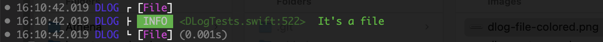
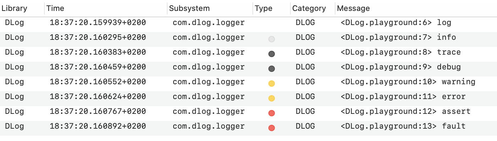
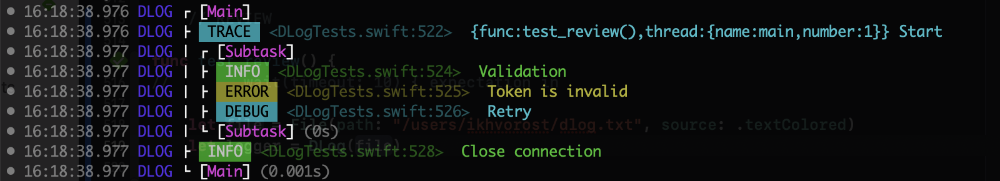

# DLog

[](https://developer.apple.com/swift)

[](https://swift.org/package-manager/)

<p align="center"></p>

DLog supports emoji and colored text output, oslog, pipelines, filtering, scopes, intervals and more.

- [Getting started](#getting-started)
- [Log levels](#log-levels)
	- [`log`](#log)
	- [`info`](#info)
	- [`trace`](#trace)
	- [`debug`](#debug)
	- [`warning`](#warning)
	- [`error`](#error)
	- [`assert`](#assert)
	- [`fault`](#fault)
- [Scope](#scope)
- [Interval](#interval)
- [Category](#category)
- [Outputs](#outputs)
	- [Text](#text)
	- [Standard](#standard)
	- [File](#file)
	- [OSLog](#oslog)
	- [Net](#net)
- [Pipeline](#pipeline)
- [Filter](#filter)
- [`.disabled`](#disabled)
- [Installation](#installation)
- [License](#license)

## Getting started

By default `DLog` provides basic text console output:

``` swift
// Import DLog package
import DLog

// Create the logger
let log = DLog()

// Log a message
log.log("Hello DLog!")
```

Outputs:

```
13:12:41.437 [00] [DLOG] [LOG] <DLog.playground:7> Hello DLog!
```

Where:
- `13:12:41.437` - timestamp (HH:mm:ss.SSS)
- `[00]` - global scope nesting level (see Scope)
- `[DLOG]` - category tag ('DLOG' by default)
- `[LOG]` - log type tag
- `<Package.playground:7>` - location (file:line)
- `Hello DLog!` - message

## Log levels

### `log`

Log a message:

``` swift
log.log("App start")
```

Outputs:

```
13:36:59.086 [00] [DLOG] [LOG] <DLog.playground:7> App start
```

### `info`

Log an information message and helpful data:

``` swift
let uuid = UUID().uuidString
log.info("uuid: \(uuid)")
```

Outputs:

```
13:37:54.934 [00] [DLOG] [INFO] <DLog.playground:8> uuid: 104B6491-B2A8-4043-A5C6-93CEB60864FA
```

### `trace`

Log the current function name or a message (if it is provided) to help debug problems during the development:

``` swift
func startup() {
	log.trace("Start")
	log.trace()
}

startup()
```

Outputs:

```
13:38:31.903 [00] [DLOG] [TRACE] <DLog.playground:8> Start
13:38:31.905 [00] [DLOG] [TRACE] <DLog.playground:9> startup()
```

### `debug`

Log a debug message to help debug problems during the development:

``` swift
let session = URLSession(configuration: .default)
session.dataTask(with: URL(string: "https://apple.com")!) { data, response, error in
	guard let http = response as? HTTPURLResponse else { return }

	let text = HTTPURLResponse.localizedString(forStatusCode: http.statusCode)
	log.debug("\(http.url!.absoluteString): \(http.statusCode) - \(text)")
}
.resume()
```

Outputs:

```
13:39:41.662 [00] [DLOG] [DEBUG] <DLog.playground:12> https://www.apple.com/: 200 - no error
```

### `warning`

Log a warning message that occurred during the execution of your code.

``` swift
log.warning("No Internet connection.")
```

Outputs:

```
13:44:49.992 [00] [DLOG] [WARNING] <DLog.playground:7> No Internet connection.
```

### `error`

Log an error that occurred during the execution of your code.

``` swift
let fromURL = URL(fileURLWithPath: "source.txt")
let toURL = URL(fileURLWithPath: "destination.txt")
do {
	try FileManager.default.moveItem(at: fromURL, to: toURL)
}
catch {
	log.error(error.localizedDescription)
}
```

Outputs:

```
13:53:20.398 [00] [DLOG] [ERROR] <DLog.playground:13> “source.txt” couldn’t be moved to “com.apple.dt.playground.stub.iOS_Simulator.DLog-AA29FA84-10A1-45D7-BAEC-FC5402BAFB0C” because either the former doesn’t exist, or the folder containing the latter doesn’t exist.
```

### `assert`

Sanity check and log a message (if it is provided) when a condition is false.

``` swift
let user = "John"
let password = ""

log.assert(user.isEmpty == false, "User is empty")
log.assert(password.isEmpty == false)
log.assert(password.isEmpty == false, "Password is empty")
```

Outputs:

```
13:55:15.108 [00] [DLOG] [ASSERT] <DLog.playground:11>
13:55:15.110 [00] [DLOG] [ASSERT] <DLog.playground:12> Password is empty
```

### `fault`

Log a critical bug that occurred during the execution in your code.

``` swift
guard let modelURL = Bundle.main.url(forResource: "DataModel", withExtension:"momd") else {
	log.fault("Error loading model from bundle")
	abort()
}
```

Outputs:

```
13:56:46.895 [00] [DLOG] [FAULT] <DLog.playground:8> Error loading model from bundle
```

## Scope

`scope` provides a mechanism for grouping and labeling work that's done in your program, so that can see all log messages related to the defined scope of your code in a tree view:

``` swift
log.scope("Loading") {
	if let path = Bundle.main.path(forResource: "data", ofType: "json") {
		log.info("File: \(path)")
		if let data = try? String(contentsOfFile: path) {
			log.debug("Loaded \(data.count) bytes")
		}
	}
}
```

Outputs:

```
14:41:31.175 [01] [DLOG] ┌ [Loading]
14:41:31.176 [01] [DLOG] |	[INFO] <DLog.playground:9> File: .../data.json
14:41:31.178 [01] [DLOG] |	[DEBUG] <DLog.playground:11> Loaded 33 bytes
14:41:31.178 [01] [DLOG] └ [Loading] (0.003s)
```

Where:
 - `[01]` - global scope level
 - `[Loading]` - a name of the scope
 - `(0.028s)` - a time duration of the scope

You can get duration value of a finished scope programatically:

```
var scope = log.scope("scope") {
	...
}

print(scope.duration)
```

It's possible to `enter` and `leave` a scope asynchronously:

``` swift
let scope = log.scope("Request")
scope.enter()

let session = URLSession(configuration: .default)
session.dataTask(with: URL(string: "https://apple.com")!) { data, response, error in
	defer {
		scope.leave()
	}

	guard let data = data, let http = response as? HTTPURLResponse else {
		return
	}

	log.debug("\(http.url!.absoluteString) - HTTP \(http.statusCode)")
	log.debug("Loaded: \(data.count) bytes")
}
.resume()
```

Outputs:

```
14:45:42.446 [01] [DLOG] ┌ [Request]
14:45:44.094 [01] [DLOG] |	[DEBUG] <DLog.playground:21> https://www.apple.com/ - HTTP 200
14:45:44.095 [01] [DLOG] |	[DEBUG] <DLog.playground:22> Loaded: 69836 bytes
14:45:44.095 [01] [DLOG] └ [Request] (1.649s)
```

Scopes can be nested one into one and that implements a global stack of scopes:

``` swift
log.scope("Loading") {
	if let url = Bundle.main.url(forResource: "data", withExtension: "json") {
		log.info("File: \(url)")

		if let data = try? Data(contentsOf: url) {
			log.debug("Loaded \(data.count) bytes")

			log.scope("Parsing") {
				if let items = try? JSONDecoder().decode([Item].self, from: data) {
					log.debug("Parsed \(items.count) items")
				}
			}
		}
	}
}
```

Outputs:

```
15:11:11.502 [01] [DLOG] ┌ [Loading]
15:11:11.503 [01] [DLOG] |	[INFO] <DLog.playground:13> File: .../data.json
15:11:11.504 [01] [DLOG] |	[DEBUG] <DLog.playground:16> Loaded 121 bytes
15:11:11.504 [02] [DLOG] |	┌ [Parsing]
15:11:11.505 [02] [DLOG] |	|	[DEBUG] <DLog.playground:20> Parsed 3 items
15:11:11.512 [02] [DLOG] |	└ [Parsing] (0.008s)
15:11:11.530 [01] [DLOG] └ [Loading] (0.028s)
```

As you can see from the sample above the scopes have different scope nesting levels "Loading" - [01] and "Parsing" - [02] and it's useful for filtering.

For multithreading logging with scopes you should pin your internal logs to the current scope because each log function will be attached to the top scope from the global stack and you messages can be shown under other scopes otherwise. With this approach you can also pin your messages to any needed scope:

```
log.scope("Loading") { scope1 in
	scope1.log("Pinned to Loading")

	scope1.scope("Parsing: Pinned to Loading") { scope2 in
		scope2.debug("Pinned to Parsing")

		scope1.info("Pinned to Loading")
	}
}
```

Outputs:

```
16:01:17.690 [01] [DLOG] ┌ [Loading]
16:01:17.691 [01] [DLOG] |	[LOG] <DLog.playground:7> Pinned to Loading
16:01:17.692 [02] [DLOG] |	┌ [Parsing: Pinned to Loading]
16:01:17.692 [02] [DLOG] |	|	[DEBUG] <DLog.playground:10> Pinned to Parsing
16:01:17.692 [01] [DLOG] |	[INFO] <DLog.playground:12> Pinned to Loading
16:01:17.692 [02] [DLOG] |	└ [Parsing: Pinned to Loading] (0.000s)
16:01:17.717 [01] [DLOG] └ [Loading] (0.027s)
```

## Interval

`interval` measures performance of your code by time durations and logs a detailed message with accumulated statistics:

``` swift
for _ in 0...10 {
	log.interval("Sort") {
		var arr = (1...10000).map {_ in arc4random()}
		arr.sort()
	}
}
```

Outputs:

```
16:08:28.484 [00] [DLOG] [INTERVAL] <DLog.playground:7> [Sort] Count: 1, Total: 0.306s, Min: 0.306s, Max: 0.306s, Avg: 0.306s
16:08:28.785 [00] [DLOG] [INTERVAL] <DLog.playground:7> [Sort] Count: 2, Total: 0.598s, Min: 0.292s, Max: 0.306s, Avg: 0.299s
16:08:29.131 [00] [DLOG] [INTERVAL] <DLog.playground:7> [Sort] Count: 3, Total: 0.943s, Min: 0.292s, Max: 0.345s, Avg: 0.314s
16:08:29.432 [00] [DLOG] [INTERVAL] <DLog.playground:7> [Sort] Count: 4, Total: 1.242s, Min: 0.292s, Max: 0.345s, Avg: 0.310s
16:08:29.698 [00] [DLOG] [INTERVAL] <DLog.playground:7> [Sort] Count: 5, Total: 1.506s, Min: 0.265s, Max: 0.345s, Avg: 0.301s
16:08:29.974 [00] [DLOG] [INTERVAL] <DLog.playground:7> [Sort] Count: 6, Total: 1.781s, Min: 0.265s, Max: 0.345s, Avg: 0.297s
16:08:30.244 [00] [DLOG] [INTERVAL] <DLog.playground:7> [Sort] Count: 7, Total: 2.049s, Min: 0.265s, Max: 0.345s, Avg: 0.293s
16:08:30.505 [00] [DLOG] [INTERVAL] <DLog.playground:7> [Sort] Count: 8, Total: 2.309s, Min: 0.260s, Max: 0.345s, Avg: 0.289s
16:08:30.778 [00] [DLOG] [INTERVAL] <DLog.playground:7> [Sort] Count: 9, Total: 2.581s, Min: 0.260s, Max: 0.345s, Avg: 0.287s
16:08:31.040 [00] [DLOG] [INTERVAL] <DLog.playground:7> [Sort] Count: 10, Total: 2.841s, Min: 0.260s, Max: 0.345s, Avg: 0.284s
16:08:31.328 [00] [DLOG] [INTERVAL] <DLog.playground:7> [Sort] Count: 11, Total: 3.128s, Min: 0.260s, Max: 0.345s, Avg: 0.284s
```

Where:
 - `[Sort]` - a name of the interval
 - `Count` - a number of calls
 - `Total` - total time duration
 - `Min` - the shortest time duration
 - `Max` - the longest time duration
 - `Avg` - average time duration


You can get all metrics values of an interval programatically:

```
let interval = log.interval("signpost") {
	...
}

print(interval.count)
print(interval.duration)
print(interval.minDuration)
print(interval.maxDuration)
print(interval.avgDuration)
```

To measure asynchronous tasks you can use `begin` and `end` methods:

``` swift
let interval = log.interval("Video")
interval.begin()

let asset = AVURLAsset(url: url)
asset.loadValuesAsynchronously(forKeys: ["duration"]) {
	let status = asset.statusOfValue(forKey: "duration", error: nil)
	if status == .loaded {
		log.info("Duration: \(asset.duration.value)")
	}
	interval.end()
}
```

Outputs:

```
00:42:25.885 [00] [DLOG] [INFO] <Package.playground:16> Duration: 155000
00:42:25.888 [00] [DLOG] [INTERVAL] <Package.playground:9> [Video] Count: 1, Total: 0.390s, Min: 0.390s, Max: 0.390s, Avg: 0.390s
```

## Category

You can define category name to differentiate unique areas and parts of your app and DLog uses this value to categorize and filter related log messages. For example, you might define separate strings for your app’s user interface, data model, and networking code.

``` swift
let log = DLog()
let tableLog = log["TABLE"]
let netLog = log["NET"]

log.debug("Refresh")
netLog.debug("Successfully fetched recordings.")
tableLog.debug("Updating with network response.")
```

Outputs:

```
16:21:10.777 [00] [DLOG] [DEBUG] <DLog.playground:9> Refresh
16:21:10.779 [00] [NET] [DEBUG] <DLog.playground:10> Successfully fetched recordings.
16:21:10.779 [00] [TABLE] [DEBUG] <DLog.playground:11> Updating with network response.
```

## Outputs

### Text

`Text` is a source output that generates text representation of log messages. It doesn't deliver text to any target outputs (stdout, file etc.) and usually other outputs use it.

It supports thee styles:
- `.plain` - universal plain text
- `.emoji` - text with type icons for info, debug etc. (useful for XCode console)
- `.colored` - colored text with ANSI escape codes (useful for Terminal and files)

``` swift
let outputs = [
	"Plain" : Text(style: .plain),
	"Emoji" : Text(style: .emoji),
	"Colored" : Text(style: .colored),
]

for (name, output) in outputs {
	let log = DLog(output)

	print(name)
	print(log.info("info")!)
	print(log.error("error")!)
	print(log.fault("fatal")!)
	print("")
}
```

Outputs:

```
Plain
16:25:38.303 [00] [DLOG] [INFO] <DLog.playground:16> info
16:25:38.305 [00] [DLOG] [LOG] <DLog.playground:17> log
16:25:38.311 [00] [DLOG] [FAULT] <DLog.playground:18> fatal

Emoji
16:25:38.312 [00] [DLOG] ✅ [INFO] <DLog.playground:16> info
16:25:38.312 [00] [DLOG] 💬 [LOG] <DLog.playground:17> log
16:25:38.312 [00] [DLOG] 🆘 [FAULT] <DLog.playground:18> fatal

Colored
16:25:38.312 [00] DLOG  INFO  <DLog.playground:16> info
16:25:38.318 [00] DLOG  LOG  <DLog.playground:17> log
16:25:38.318 [00] DLOG  FAULT  <DLog.playground:18> fatal
```

Colored text in Terminal:

<br>

You can also use shortcuts `.textPlain`, `.textEmoji` and `.textColored` to create the output:

``` swift
let logEmoji = DLog(.textEmoji)
```

### Standard

`Standard` is a target output that can output text messages to POSIX streams:
- `.out` - Standard Output (stdout)
- `.err` - Standard Error (stderr)

``` swift
let logOut = DLog(Standard(stream: .out)) // Or Standard()
let logErr = DLog(Standard(stream: .err))
```

You can also use shortcuts `.stdout` and `.stderr` to create the output to the logger:

``` swift
let log = DLog(.stderr)
log.info("It's error stream")
```

By default `Standard` uses `Text(style: .plain)` output as a source to write text to the streams but you can set other:

``` swift
let output = Standard(source: .textEmoji)
let log = DLog(output)

log.info("Emoji")
```

Outputs:

```
17:59:55.516 [00] [DLOG] ✅ [INFO] <DLog.playground:7> Emoji
```

### File

`File` is a target output that writes text messages to a file by a provided path:

``` swift
let output = File(path: "/users/user/dlog.txt")
let log = DLog(output)

log.info("It's a file")
```

By default `File` output clears content of a opened file but if you want to append data to the existed file you should set `append` parameter to `true`:

``` swift
let output = File(path: "/users/user/dlog.txt", append: true)
```

You can also use `.file` shortcut to create the output:

``` swift
let log = DLog(.file("dlog.txt"))
```

`File` output uses `Text(style: .plain)` as a source by default but you can change it:

``` swift
let output = File(path: "/users/user/dlog.txt", source: .textColored)
let log = DLog(output)

log.scope("File") {
	log.info("It's a file")
}
```
File "dlog.txt":

<br>

### OSLog

`OSLog` is a target output that writes messages to the Unified Logging System (https://developer.apple.com/documentation/os/logging) that captures telemetry from your app for debugging and performance analysis and then you can use various tools to retrieve log information such as: `Console` app, command line tool `log` etc.

To create `OSLog` you can use subsystem strings that identify major functional areas of your app, and you specify them in reverse DNS notation—for example, `com.your_company.your_subsystem_name`. `OSLog` uses `com.dlog.logger` subsystem by default:

``` swift
let output1 = OSLog() // subsystem = "com.dlog.logger"
let output2 = OSLog(subsystem: "com.company.app") // subsystem = "com.company.app"
```

You can also use `.oslog` shortcut to create the output for the logger:

``` swift
let log1 = DLog(.oslog)
let log2 = DLog(.oslog("com.company.app"))
```

`trace`, `info`, `debug`, `error` and `fault` methods map to the system logger ones:

``` swift
let log = DLog(.oslog)

log.trace("trace")
log.info("info")
log.debug("debug")
log.error("error")
log.fault("fault")
```

Console.app:

<br>

The `scope` maps to the system logger's activities:

``` swift
let log = DLog(.oslog)

log.scope("Loading") {
	log.info("start")
	log.scope("Parsing") {
		log.debug("Parsed 1000 items")
	}
	log.info("finish")
}

```

Console.app:

<br>

The `interval` maps to to the system logger's signposts:

``` swift
let log = DLog(.oslog)

for _ in 0..<10 {
	log.interval("Sorting") {
		let delay = [0.1, 0.2, 0.3].randomElement()!
		Thread.sleep(forTimeInterval: delay)
		log.debug("Sorted")
	}
}
```

Instruments.app:

<br>


### Net

`Net` is a target output that sends log messages to `NetConsole` service that can be run from a command line on your machine. The service is provided as executable inside DLog package and to start it you should run `sh NetConsole.command` (or just click on NetConsole.command file) inside the package's folder and then the service starts listening for incoming messages:

```shell
$ sh NetConsole.command # or 'xcrun --sdk macosx swift run'
> [39/39] Linking NetConsole
> NetConsole for DLog v.1.0
```

Then the output connects and sends your log messages to `NetConsole`:

``` swift
let log = DLog(Net())

log.scope("Main") {
	log.trace("Start")
	log.scope("Subtask") {
		log.info("Validation")
		log.error("Token is invalid")
		log.debug("Retry")
	}
	log.info("Close connection")
}
```

> **iOS 14**: Don't forget to make next changes in your Info.plist to support Bonjour:
> ```xml
> <key>NSLocalNetworkUsageDescription</key>
> <string>Looking for local tcp Bonjour  service</string>
> <key>NSBonjourServices</key>
> <array>
> 	<string>_dlog._tcp</string>
> </array>
> ```

Terminal:
<p></p>


By default `Net` uses `Text(style: .colored)` output as a source but you can set other:

``` swift
let log = DLog(Net(source: .textEmoji))
```

And you can also use `.net` shortcut to create the output for the logger.

``` swift
let log = DLog(.net)
```

To connect to a specific instance of the service in your network you should provide an unique name to both the service and the output ("DLog" is used by default). To run the NetConsole service with a specific name run next command:

Terminal:
``` shell
sh NetConsole.command -n "MyLogger" # or 'xcrun --sdk macosx swift run NetConsole -n "MyLogger"'
```

Swift:
``` swift
let log = DLog(.net("MyLogger"))
```

For more params you can look at help:

``` shell
sh NetConsole.command --help  # or 'xcrun --sdk macosx swift run NetConsole --help'
OVERVIEW: NetConsole for DLog v.1.0

USAGE: net-console [--name <name>] [--auto-clear] [--debug]

OPTIONS:
  -n, --name <name>       The name by which the service is identified to the network. The name must be unique and by default it equals
                          "DLog". If you pass the empty string (""), the system automatically advertises your service using the computer
                          name as the service name.
  -a, --auto-clear        Clear a terminal on new connection.
  -d, --debug             Enable debug messages.
  -h, --help              Show help information.
```

## Pipeline

As described above `File`, `Net` and `Standard` outputs have `source` parameter in their initializers to set a source output that is very useful if we want to change default outputs:

``` swift
let std = Standard(stream: .out, source: .textEmoji)
let log = DLog(std)
```

Actually any output has `source` property to set:

``` swift
let std = Standard()
std.source = .textEmoji
let log = DLog(std)
```

So that it's possible to make a linked list of outputs:

``` swift
let text: LogOutput = .textEmoji

let std = Standard()
std.source = text

let file = File(path: "dlog.txt")
file.source = std

let log = DLog(file)
```

Where `text` is a source for `std` and `std` is a source for `file`: text --> std --> file. And now each text message will be sent to both `std` and `file` outputs consecutive.

Lets rewrite this shorter:

``` swift
let log = DLog(.textEmoji => .stdout => .file("dlog.txt"))
```

Where `=>` is pipeline operator which defines a combined output from two outputs where the first one is a source and second is a target.

You can combine any needed outputs together:
``` swift
// All log messages will be written as colored text (with escape codes) to the file

let log = DLog(.textColored => .file(path))
```

Also this allows the creation of a chained output from multiple outputs one by one by:

``` swift
// All log messages will be written:
// 1) as plain text to stdout
// 2) as colored text (with escape codes) to the file

let log = DLog(.textPlain => .stdout => .textColored => .file(path))
```

## Filter

`.filter` represents a pipe output that can filter log messages by next available fields: `time`, `category`, `type`, `fileName`, `funcName`, `line`, `text` and by a specific scope. You can inject it to your pipeline to log needed data only.

Examples:

1) Log messages from 'NET' category only
``` swift
let log = DLog(.textPlain => .filter { $0.category == "NET" } => .stdout)

log.info("info")
let netLog = categoryLog["NET"]
netLog.info("info")
```
Outputs:
```
23:37:32.582 [NET] [INFO] <Package.playground:11> info

```
2) Log debug messages only
``` swift
let log = DLog(.textPlain => .filter { $0.type == .debug } => .stdout)

log.trace()
log.info("info")
log.debug("debug")
```
Outputs:
```
23:43:55.594 [DLOG] [DEBUG] <Package.playground:11> debug
```

3) Log messages that contain "hello" only
``` swift
let log = DLog(.textPlain => .filter { $0.text.contains("hello") } => .stdout)

log.info("hello world")
log.debug("debug")
log.info("info")
```
Outputs:
```
23:49:01.047 [DLOG] [INFO] <Package.playground:9> hello world
```

3) Log messages that are related to a specific scope:

``` swift
let log = DLog(.textPlain => .filter { ($0 as? LogScope)?.text == "Load" || $0.scope?.text == "Load" } => .stdout)

log.info("info")
log.scope("Load") {
	log.debug("load")
	log.error("load")
	log.scope("Parse") {
		log.debug("parse")
		log.error("parse")
	}
}
log.fault("fault")
```

Outputs:

```
17:22:57.418 [01] [DLOG] ┌ [Load]
17:22:57.451 [01] [DLOG] |	[DEBUG] <DLog.playground:9> load
17:22:57.451 [01] [DLOG] |	[ERROR] <DLog.playground:10> load
17:22:57.520 [01] [DLOG] └ [Load] (0.102s)
```

## `.disabled`

It is the shared disabled logger constant that prevents DLog from logging any messages. It's useful when you want to turn off logging for some build configuration, preference, condition etc.

``` swift
// Logging is enabled for `Debug` build configuration only

#if DEBUG
	let log = DLog(.textPlain => .file(path))
#else
	let log = DLog.disabled
#endif
```

## Installation

### XCode project

Select `Xcode` > `File` > `Swift Packages` > `Add Package Dependency...` > Paste `https://github.com/ikhvorost/DLog.git` and then `import DLog` in source files.

### Swift Package

``` swift
let package = Package(
	...
	dependencies: [
    	.package(url: "https://github.com/ikhvorost/DLog.git", from: "1.0.0")
	],
	targets: [
		.target(name: "YourPackage",
			dependencies: [
				.product(name: "DLog", package: "DLog")
			]
		),
		...
	...
)
```

### Manual

Just copy source files to your project.

## License

DLog is available under the MIT license. See the [LICENSE](LICENSE) file for more info.
